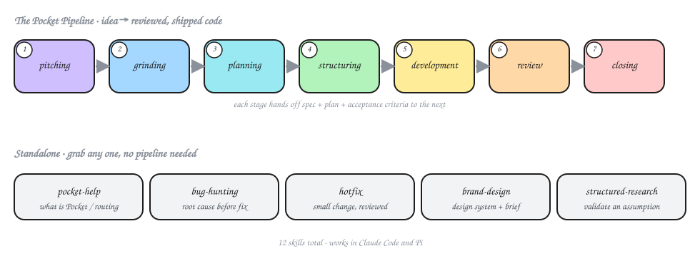

<div align="center">

# 🪐 Pocketto

**Structured AI coding workflows for [Claude Code](https://docs.claude.com/en/docs/claude-code) and [Pi](https://github.com/badlogic/pi-mono).**
From a rough idea to reviewed, shipped code — without the agent improvising.

[](https://www.npmjs.com/package/pocketto-pi)
[](https://docs.claude.com/en/docs/claude-code)
[](https://nodejs.org)
[](#license)

</div>

---

## Why Pocketto?

Coding agents are great at *writing* code and bad at *not skipping steps*. Pocketto adds the missing discipline:

- **Plan before code.** Specs, acceptance criteria, and TDD-structured plans come before a single line is written.
- **Delegate with contracts.** Every subagent gets a "Pocket Packet" — objective, verification, stop conditions. No packet, no spawn.
- **Gate before done.** Reviews and a hard close step keep finished work from rotting in `IN_PROGRESS` limbo.

13 skills, one namespace, zero lock-in — reach for the full pipeline on real features, or grab a standalone skill for everyday work. Working in a team? Opt into [Pocket Enterprise](#pocket-enterprise-opt-in) and the same pipeline tracks itself on GitHub — issues, PRs, and review verdicts.

<p align="center">
  
</p>

## Install

<table>
<tr><th>Pi</th><th>Claude Code</th></tr>
<tr><td>

```bash
pi install git:github.com/rfxlamia/pocketto
# or
pi install npm:pocketto-pi
```

</td><td>

```bash
/plugin marketplace add rfxlamia/pocketto
/plugin install pocketto@pocketto
/reload-plugins
```

</td></tr>
</table>

### Pi extensions (Pi users)

Pocket's skills call Pi extensions for their core features — **advisor** (review gates), **context7** (library docs), and **subagents** (delegation). After installing, pull them in with one command:

```bash
npx pocketto-pi setup-extensions        # required extensions
npx pocketto-pi setup-extensions --all  # + recommended extensions
npx pocketto-pi doctor                  # check what's installed / missing
```

| Required | Unlocks |
|----------|---------|
| `pi-mcp-adapter` | context7 MCP — library-aware code generation |
| `@gotgenes/pi-subagents` | subagent delegation + parallel reviews |
| `@juicesharp/rpiv-advisor` | advisor — LLM-to-LLM review/escalation gates |

Recommended (install with `--all`): `@juicesharp/rpiv-ask-user-question`, `@tintinweb/pi-tasks`, `@aliou/pi-processes`.

> **New here?** Start with [`pocket-help`](#standalone-skills) — a compact router that explains what Pocket is and which skill to reach for, without loading every skill into context.

## Quickstart

Run a feature through the full pipeline — each stage hands off to the next:

```bash
/pocketto:pocket-grinding   "add dark mode toggle"   # → spec + acceptance criteria
/pocketto:pocket-planning                            # → TDD execution plan
/pocketto:pocket-development                          # → subagents build it, task by task, with an in-loop audit and phase-level pass
/pocketto:pocket-closing    <plan_dir>               # → reconcile, close, summarize
```

Or just fix something:

```bash
/pocketto:bug-hunting   "checkout total is off by one cent"
/pocketto:hotfix        "bump the rate-limit window to 60s"
```

## The 13 skills

### Pipeline (chained)

Each stage invokes the next at handoff, carrying spec, plan, and acceptance criteria forward. Use these for real features and non-trivial work.

| # | Skill | When to reach for it |
|---|-------|----------------------|
| 1 | `pocket-pitching` | Rough idea, no clear problem yet |
| 2 | `pocket-grinding` | Clear problem — need a spec + acceptance criteria |
| 3 | `pocket-planning` | Spec ready — need an execution plan |
| 4 | `pocket-structuring` | Plan ready — index + task files for all plans; phase manifests when `phaseCount > 1` |
| 5 | `pocket-development` | Plan ready — execute task-by-task via subagents, with an in-loop audit and phase-level pass |
| 6 | `pocket-closing` | After the phase-level pass — gate, close, summarize |

### Standalone skills

Lighter, single-purpose, no pipeline. Reach for these for everyday work.

| Skill | When to reach for it |
|-------|----------------------|
| `pocket-help` | "What is Pocket?", which skill to use, how the flow works |
| `pocket-init` | Onboard an existing project: generate CLAUDE.md/AGENTS.md, enable enterprise |
| `bug-hunting` | Fix a bug, debug a failure, audit code for hidden bugs |
| `hotfix` | Small-to-medium change where the full pipeline is overkill |
| `brand-design` | Design system, creative brief, brand identity, UI tokens |
| `structured-research` | Validate an explicit assumption before it enters planning |
| `create-pr` | Open the phase PR linked to the Pocket issue (enterprise mode) |

<details>
<summary><b>📖 Full skill reference</b> — what each skill actually does</summary>

<br>

**`pocket-pitching`** — Pre-grinding problem exploration. Use **before** `pocket-grinding` when the problem is unformed. Guides diverge→converge with structured brainstorming and LLM-to-LLM curation, then produces a pitch exploration doc.
*Trigger:* "pitch this", "explore this idea", "I have a rough idea".

**`pocket-grinding`** — BDD-driven feature/fix discovery before any implementation. Use when planning a feature, designing a fix, or exploring options. Invokes `pocket-planning` at handoff.
*Trigger:* "pocket-grinding", "brainstorm", "think through", "plan this", "before we build".

**`pocket-planning`** — Converts a `pocket-grinding` spec into a TDD-structured execution plan of full Pocket Packets. Outputs tasks ready to dispatch via `pocket-development`.
*Trigger:* "create plan", "build plan", or invoked by `pocket-grinding`.

**`pocket-structuring`** — Decomposes every `pocket-planning` plan into `execution-plan/index.md` + per-task files. Phase manifests (`execution-plan/phase-N.md`) only when `phaseCount > 1`. Hands phases to `pocket-development` one at a time.
*Trigger:* "structure plan", "split plan", or invoked by `pocket-planning`.

**`pocket-development`** — Precise subagent delegation for task-by-task execution. Every delegation requires a Pocket Packet — a structured contract with objective, verification criteria, and stop conditions. Enforces 6 iron laws: no packet = no spawn. Runs an in-loop audit per task (mechanical gate, then a read-only auditor subagent covering spec compliance and code quality) and, once every task is DONE, a phase-level pass over the whole phase — including delegating and recording append-only fixes for any failing findings — before handing off to `pocket-closing`.
*Trigger:* "execute plan", "delegate tasks", "dispatch subagents".

**`pocket-closing`** — Terminal stage. **User-triggered** after `pocket-development`'s phase-level pass writes verdicts. Reconciles every `reviews/*.json` against `log.json`, gates the close on verdicts (any fail or unreviewed task → `CLOSE_BLOCKED`), advances passed phases `REVIEW → DONE`, runs `log close`, and writes `closeout.md`. Returns `CLOSED`, `PHASE_ADVANCED`, `CLOSE_BLOCKED`, or `ALREADY_CLOSED`.
*Trigger:* `/pocketto:pocket-closing <plan_dir>`.

**`bug-hunting`** — Systematic debugging with confirmed root cause before any fix. Reactive (fix known bug) and proactive (hunt hidden bugs) modes. Enforces: claim ≠ evidence ≠ root cause ≠ fix.
*Trigger:* "fix bug", "debug", "why is X broken", or proactive code review.

**`hotfix`** — Fast iteration for small-to-medium changes. Enforces brief-plan + subagent-review gates before implementation — accuracy without full pipeline ceremony.
*Trigger:* "quick fix", "small change", "just update X".

**`brand-design`** — Brand-aware design system generator that acts as Head of Brand. Translates abstract brand language into a mathematically-validated, implementation-ready design system, writes `creative-brief.md` as the source of truth for all UI/UX, and can compile it to framework tokens (Tailwind v4 `@theme`, v3 preset, or plain CSS custom properties).
*Trigger:* "brand-design", "design system", "creative brief", "brand identity", "set up UI tokens", "export design tokens".
*Deliverables:* `docs/pocket/rule/creative-brief.md`, `creative-brief-preview.html`, `.claude/rules/brand-design.md`, optional generated token file (`brand.theme.css` / `tailwind.brand.preset.js` / `tokens.css`).

**`pocket-help`** — Compact onboarding and routing guide for the whole system. Explains what Pocket is, when it beats lighter flows, and which skill to invoke — without loading every skill into context.
*Trigger:* "what is pocket", "how do I use pocket", "which pocket skill", "pocket-help".

**`pocket-init`** — Onboards an existing (brownfield) project onto Pocket. Scans the codebase and writes an evidence-based project memory file (`CLAUDE.md` on Claude Code, `AGENTS.md` on Pi) in a merge-safe managed section, then optionally enables Pocket Enterprise (`pocketto-pi mode init`) and scaffolds GitHub issue/PR templates (`pocketto-pi scaffold github`). Enterprise stays strictly opt-in.
*Trigger:* "pocket-init", "set up pocket", "onboard this project", "generate CLAUDE.md", "enable enterprise mode".

**`create-pr`** — Pocket Enterprise recorder that opens (or reuses) the GitHub PR for a completed development phase on the **current branch** — it never manages branches. Commits traveling state (`log.json` + plan/spec docs), formats a structured What/Why/How-to-Test body linked to the Pocket issue (`refs`/`closes`), and records the PR in `.pocket-meta.json`. Requires enterprise mode.
*Trigger:* "create-pr", "open a PR", or offered by `pocket-development` after a phase completes in enterprise mode.

**`structured-research`** — Validates an explicit assumption before it leaks into planning or code. Operationalizes the belief into a falsifiable question, recommends a research methodology (non-binding) from a catalog of techniques, gathers cited evidence, then returns a graded verdict — Confirmed / Refuted / Inconclusive — with an advisory recommendation.
*Trigger:* "structured-research", "validate this assumption", "is it true that", "research whether", "verify my assumption".
*Deliverables:* `docs/pocket/research/<date>-<slug>/research-report.md`.

</details>

## Pocket Enterprise (opt-in)

Pocket is local-first — everything above works with zero GitHub coupling. **Pocket Enterprise** is the opt-in team layer: the same pipeline, but every stage leaves a trace on GitHub so the team can follow progress without opening your filesystem.

| Stage | What enterprise mode adds |
|-------|---------------------------|
| `pocket-init` | One-time setup: enables the mode, scaffolds `.github/` issue + PR templates, creates the `pocket-plan` label |
| `pocket-grinding` | Creates a GitHub issue from the approved spec — structured summary plus the **full spec** in a collapsible section |
| `pocket-development` | Offers `/pocketto:create-pr` when a phase completes; posts the phase-level pass's per-task verdicts as a PR summary comment + inline findings (reconciled across re-runs, no duplicates); syncs a live task checklist comment to the issue |
| `create-pr` | Opens the phase PR on the current branch, linked to the issue (`refs`/`closes`), with traveling state committed |
| `pocket-closing` | Posts the closeout comment to the issue; with `require_approval: true`, blocks the close until the PR is APPROVED |

**Enable it:** run `/pocketto:pocket-init` (guided), or directly:

```bash
npx pocketto-pi mode init --enterprise true --branch-strategy branch --create-pr true
```

This writes a `## Pocket Enterprise` block into `AGENTS.md` (or `CLAUDE.md` via `--file CLAUDE.md`) plus a `.gitattributes` for LF-normalized traveling state. Requirements: a git remote and an authenticated [`gh` CLI](https://cli.github.com). Design guarantees:

- **Opt-in & fail-closed** — without the config block (or on any mode error), no skill ever calls GitHub; the workflow is byte-identical to local mode.
- **One-way sync** — GitHub is the output, your repo stays the source of truth.
- **Human gates stay human** — Pocket never merges PRs and never closes issues; the issue closes when a supervisor merges the final PR (`closes #N`).

## CLI

The pocket skills drive a single cross-platform Node CLI, run via `npx` — no install, PATH setup, or Python required. Works the same on Windows, macOS, and Linux. Requires Node.js ≥ 18.

| Command | What it does |
|---------|--------------|
| `npx pocketto-pi structure <execution-plan.md> [--dry-run] [--force] [--reset]` | Decompose a plan into `execution-plan/` (index + task files; phase manifests when `phaseCount > 1`) |
| `npx pocketto-pi log init <plan_dir>` | Initialize `log.json` for a plan directory |
| `npx pocketto-pi log update <plan_dir> <phase_file> <status> [--task TN] [--sha <commit>] [--allow-duplicate-sha]` | Update phase or task status |
| `npx pocketto-pi log close <plan_dir>` | Finalize log after all phases complete |
| `npx pocketto-pi doctor [--strict]` | Check required/recommended Pi extensions |
| `npx pocketto-pi mode [<dir>]` | Report Pocket Enterprise mode (from `AGENTS.md`/`CLAUDE.md`) |
| `npx pocketto-pi mode init [--file CLAUDE.md] …` | Write the enterprise config block + `.gitattributes` |
| `npx pocketto-pi meta get\|set <dir> <field> [value]` | Read/write `.pocket-meta.json` (issue/PR linkage) |
| `npx pocketto-pi format <issue\|pr\|comment\|closeout> --input <json>` | Render GitHub bodies to a temp file (`--body-file` safe) |
| `npx pocketto-pi format tasklist <plan_dir>` | Render the issue task-checklist comment from `log.json` |
| `npx pocketto-pi scaffold github [--dry-run]` | Write `.github/` issue + PR templates (idempotent) |
| `npx pocketto-pi reconcile --prior <json> --new <json>` | Set-diff review findings for PR thread upserts |

Status flow: `WAITING` → `REVIEW` → `DONE` \| `BLOCKED`

Add `--json` for a stable output envelope — `{ ok, command, cliVersion, contract, data, error }` — that skills parse instead of scraping text. Add `--contract <N>` for a version handshake that fails loudly on mismatch rather than emitting output an older skill can't read.

## 3.1.0

`pocket-structuring` now decomposes every plan into `execution-plan/index.md` + per-task files (phase manifests only when `phaseCount > 1`), instead of passthrough below 7 tasks. `structure` gains `--reset` to rebuild layout and replace `log.json` when execution progress exists (explicit, discards state); `--force` now only rebuilds + reconciles when there is no execution progress, refusing otherwise, and always refreshes the log's pipeline marker when it rebuilds. A `log.json` that exists but fails to parse is now refused (`LOG_JSON_UNPARSEABLE`) instead of being silently treated as absent — `--reset` is the explicit way to discard it. `index.md`'s Task Index table now renders in phase-group (execution) order instead of numeric task ID, matching `phase-N.md`; for single-phase plans this is also the order `log init` uses to seed dispatch state, so a plan authored out of numeric sequence now dispatches in the order it's written, not by ID. See "Migrating to 3.1.0" below if you have an in-flight plan.

## 3.0.1

Removes lingering references to deprecated skills.

## Migrating to 3.1.0

This release bumps the pipeline generation (`PIPELINE` 3 → 4): `pocket-structuring` now always writes `execution-plan/index.md` + per-task files, where before it only split into phases at 7+ tasks. Plans that already have a `log.json` are unaffected until you next run `structure` against them — a plain run repairs/no-ops without touching state; a source-plan change with execution progress still requires `--force` or `--reset` as before.

**If you interrupt `structure` while it's writing `execution-plan/` or `log.json`** (killed process, crashed machine), re-run `structure --reset` on that plan before continuing — it rebuilds both from scratch and is the only way to guarantee they're back in sync. Don't hand-edit `log.json` to try to fix a partial write.

If a plan's `log.json` reports `PIPELINE_TOO_OLD` with a numeric (not absent) pipeline marker, pin `npx -y pocketto-pi@3.0.1` to finish it under the old pipeline, then update once it's closed — same recovery pattern as 3.0.0's migration below, but for this newer boundary.

## Migrating to 3.0.0

Pocketto 3.0.0 introduces the in-loop build cycle: `pocket-development` now runs an audit per task and a phase-level pass before handoff, and — as part of that — **plans started under an older pipeline are refused, not repaired**. `log.json` gains a pipeline-version marker; a log without one (or with a lower one) makes any state-changing CLI command exit non-zero rather than silently continuing on stale assumptions.

**Before updating, close any in-flight plan.** A plan that has an open `log.json` from before 3.0.0 will be refused by the new CLI the next time a state-changing command runs against it — the refusal writes nothing, so nothing is lost, but the plan is stuck until you act.

If you're already updated and stuck mid-plan, recover by pinning:

- **CLI:** run the plan out with `npx -y pocketto-pi@2.4.4 …` instead of an unpinned `npx -y pocketto-pi …` until the plan closes.
- **Plugin (Claude Code):** the marketplace entry installs via `source: url` with no version field, so it always tracks the latest commit — there is no version to roll back to. Do not run `/plugin update` (or reinstall) until the in-flight plan closes; simply leave the currently installed plugin in place.

Once the plan is closed under the pinned CLI, drop the pin and update normally — new plans initialize with the current pipeline marker and are unaffected.

## License

[MIT](LICENSE) © [rfxlamia](https://github.com/rfxlamia)
