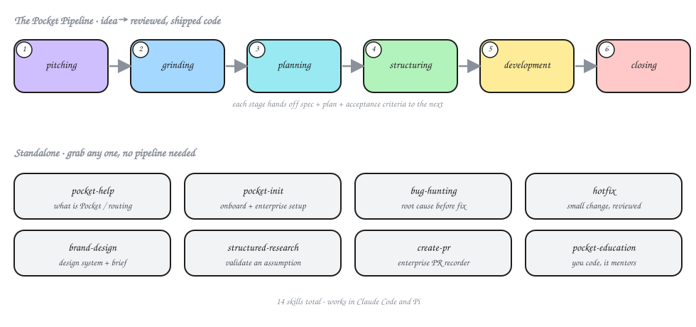

<div align="center">

# 🪐 Pocketto

**Structured AI coding workflows for [Claude Code](https://docs.claude.com/en/docs/claude-code) and [Pi](https://github.com/badlogic/pi-mono).**
From a rough idea to reviewed, shipped code — without the agent improvising.

[](https://www.npmjs.com/package/pocketto-pi)
[](https://docs.claude.com/en/docs/claude-code)
[](https://nodejs.org)
[](#license)

</div>

---

## Why Pocketto?

Coding agents are great at *writing* code and bad at *not skipping steps*. Pocketto adds the missing discipline:

- **Plan before code.** Specs, acceptance criteria, and TDD-structured plans come before a single line is written.
- **Delegate with contracts.** Every subagent gets a "Pocket Packet" — objective, verification, stop conditions. No packet, no spawn.
- **Gate before done.** Reviews and a hard close step keep finished work from rotting in `IN_PROGRESS` limbo.

13 skills across a local-first Core and an optional Enterprise adapter. Use Core for the full pipeline or standalone skills without GitHub access. If your team opts in, Enterprise consumes Core's durable lifecycle events and owns GitHub reconciliation; Core itself does not call `gh`. Core does not perform remote synchronization.

<p align="center">
  
</p>

## Install

<table>
<tr><th>Pi</th><th>Claude Code</th></tr>
<tr><td>

```bash
pi install git:github.com/rfxlamia/pocketto
# or
pi install npm:pocketto-pi
```

</td><td>

```bash
/plugin marketplace add rfxlamia/pocketto
/plugin install pocketto@pocketto
/reload-plugins
```

</td></tr>
</table>

### Release surfaces

Version `4.0.0` is built from the explicit `surfaces.json` manifest. It defines exactly four role names:

| Role | Host | Contents |
|------|------|----------|
| `pi/core` | Pi | Local-first Core workflows and neutral lifecycle CLI. |
| `pi/enterprise` | Pi | Additive Enterprise adapter and references; requires `pi/core`. |
| `claude/core` | Claude Code | Local-first Core workflows and neutral lifecycle CLI. |
| `claude/enterprise` | Claude Code | Additive Enterprise adapter and references; requires `claude/core`. |

Select the role artifact for the target host and install the matching Core role first. Release builds stage an explicit manifest role with `node scripts/build-surfaces.js --role <role> --output <artifact-dir>`. That directory contains only the selected role. An Enterprise stage is an overlay on the matching Core stage and does not include Core entry points such as `cli/index.js`. `pi install npm:pocketto-pi` publishes one package that contains both Core and Enterprise sources so either role can be staged from it; it is not itself a Core-only tree. Enterprise is optional and adds only its adapter-owned files; it does not bundle or copy Core skills. The manifest schema is `SURFACE_MANIFEST=1`. The independent protocol versions are `CONTRACT=3`, `PIPELINE=5`, `LIFECYCLE_SCHEMA=1`, and `ADAPTER_CONTRACT=1`.

### Pi extensions (Pi users)

Pocket's skills call Pi extensions for their core features — **advisor** (review gates), **context7** (library docs), and **subagents** (delegation). After installing, pull them in with one command:

```bash
npx pocketto-pi setup-extensions        # required extensions
npx pocketto-pi setup-extensions --all  # + recommended extensions
npx pocketto-pi doctor                  # check what's installed / missing
```

| Required | Unlocks |
|----------|---------|
| `pi-mcp-adapter` | context7 MCP — library-aware code generation |
| `@gotgenes/pi-subagents` | subagent delegation + parallel reviews |
| `@juicesharp/rpiv-advisor` | advisor — LLM-to-LLM review/escalation gates |

Recommended (install with `--all`): `@juicesharp/rpiv-ask-user-question`, `@tintinweb/pi-tasks`, `@aliou/pi-processes`.

> **New here?** Start with [`pocket-help`](#standalone-skills) — a compact router that explains what Pocket is and which skill to reach for, without loading every skill into context.

## Quickstart

Run a feature through the full pipeline — each stage hands off to the next:

```bash
/pocketto:pocket-grinding   "add dark mode toggle"   # → spec + acceptance criteria
/pocketto:pocket-planning                            # → TDD execution plan
/pocketto:pocket-development                          # → subagents build it, task by task, with an in-loop audit and phase-level pass
/pocketto:pocket-closing    <plan_dir>               # → reconcile, close, summarize
```

Or just fix something:

```bash
/pocketto:bug-hunting   "checkout total is off by one cent"
/pocketto:hotfix        "bump the rate-limit window to 60s"
```

## The 13 skills

### Pipeline (chained)

Each stage invokes the next at handoff, carrying spec, plan, and acceptance criteria forward. Use these for real features and non-trivial work.

| # | Skill | When to reach for it |
|---|-------|----------------------|
| 1 | `pocket-pitching` | Rough idea, no clear problem yet |
| 2 | `pocket-grinding` | Clear problem — need a spec + acceptance criteria |
| 3 | `pocket-planning` | Spec ready — need an execution plan |
| 4 | `pocket-structuring` | Plan ready — index + task files for all plans; phase manifests when `phaseCount > 1` |
| 5 | `pocket-development` | Plan ready — execute task-by-task via subagents, with an in-loop audit and phase-level pass |
| 6 | `pocket-closing` | After the phase-level pass — gate, close, summarize |

### Standalone skills

Lighter, single-purpose, no pipeline. Reach for these for everyday work.

| Skill | When to reach for it |
|-------|----------------------|
| `pocket-help` | "What is Pocket?", which skill to use, how the flow works |
| `pocket-init` | Onboard an existing project: generate CLAUDE.md/AGENTS.md, enable enterprise |
| `bug-hunting` | Fix a bug, debug a failure, audit code for hidden bugs |
| `hotfix` | Small-to-medium change where the full pipeline is overkill |
| `brand-design` | Design system, creative brief, brand identity, UI tokens |
| `structured-research` | Validate an explicit assumption before it enters planning |
| `create-pr` | Open the phase PR linked to the Pocket issue (enterprise mode) |

<details>
<summary><b>📖 Full skill reference</b> — what each skill actually does</summary>

<br>

**`pocket-pitching`** — Pre-grinding problem exploration. Use **before** `pocket-grinding` when the problem is unformed. Guides diverge→converge with structured brainstorming and LLM-to-LLM curation, then produces a pitch exploration doc.
*Trigger:* "pitch this", "explore this idea", "I have a rough idea".

**`pocket-grinding`** — BDD-driven feature/fix discovery before any implementation. Use when planning a feature, designing a fix, or exploring options. Invokes `pocket-planning` at handoff.
*Trigger:* "pocket-grinding", "brainstorm", "think through", "plan this", "before we build".

**`pocket-planning`** — Converts a `pocket-grinding` spec into a TDD-structured execution plan of full Pocket Packets. Outputs tasks ready to dispatch via `pocket-development`.
*Trigger:* "create plan", "build plan", or invoked by `pocket-grinding`.

**`pocket-structuring`** — Decomposes every `pocket-planning` plan into `execution-plan/index.md` + per-task files. Phase manifests (`execution-plan/phase-N.md`) only when `phaseCount > 1`. Hands phases to `pocket-development` one at a time.
*Trigger:* "structure plan", "split plan", or invoked by `pocket-planning`.

**`pocket-development`** — Precise subagent delegation for task-by-task execution. Every delegation requires a Pocket Packet — a structured contract with objective, verification criteria, and stop conditions. Enforces 6 iron laws: no packet = no spawn. Runs an in-loop audit per task (mechanical gate, then a read-only auditor subagent covering spec compliance and code quality) and, once every task is DONE, a phase-level pass over the whole phase — including delegating and recording append-only fixes for any failing findings — before handing off to `pocket-closing`.
*Trigger:* "execute plan", "delegate tasks", "dispatch subagents".

**`pocket-closing`** — Terminal stage. **User-triggered** after `pocket-development`'s phase-level pass writes verdicts. Reconciles every `reviews/*.json` against `log.json`, gates the close on verdicts (any fail or unreviewed task → `CLOSE_BLOCKED`), advances passed phases `REVIEW → DONE`, runs `log close`, and writes `closeout.md`. Returns `CLOSED`, `PHASE_ADVANCED`, `CLOSE_BLOCKED`, or `ALREADY_CLOSED`.
*Trigger:* `/pocketto:pocket-closing <plan_dir>`.

**`bug-hunting`** — Systematic debugging with confirmed root cause before any fix. Reactive (fix known bug) and proactive (hunt hidden bugs) modes. Enforces: claim ≠ evidence ≠ root cause ≠ fix.
*Trigger:* "fix bug", "debug", "why is X broken", or proactive code review.

**`hotfix`** — Fast iteration for small-to-medium changes. Enforces brief-plan + subagent-review gates before implementation — accuracy without full pipeline ceremony.
*Trigger:* "quick fix", "small change", "just update X".

**`brand-design`** — Brand-aware design system generator that acts as Head of Brand. Translates abstract brand language into a mathematically-validated, implementation-ready design system, writes `creative-brief.md` as the source of truth for all UI/UX, and can compile it to framework tokens (Tailwind v4 `@theme`, v3 preset, or plain CSS custom properties).
*Trigger:* "brand-design", "design system", "creative brief", "brand identity", "set up UI tokens", "export design tokens".
*Deliverables:* `docs/pocket/rule/creative-brief.md`, `creative-brief-preview.html`, `.claude/rules/brand-design.md`, optional generated token file (`brand.theme.css` / `tailwind.brand.preset.js` / `tokens.css`).

**`pocket-help`** — Compact onboarding and routing guide for the whole system. Explains what Pocket is, when it beats lighter flows, and which skill to invoke — without loading every skill into context.
*Trigger:* "what is pocket", "how do I use pocket", "which pocket skill", "pocket-help".

**`pocket-init`** — Onboards an existing (brownfield) project onto Pocket. Scans the codebase and writes an evidence-based project memory file (`CLAUDE.md` on Claude Code, `AGENTS.md` on Pi) in a merge-safe managed section, then optionally enables Pocket Enterprise (`pocketto-pi mode init`) and scaffolds GitHub issue/PR templates (`pocketto-pi scaffold github`). Enterprise stays strictly opt-in.
*Trigger:* "pocket-init", "set up pocket", "onboard this project", "generate CLAUDE.md", "enable enterprise mode".

**`create-pr`** — Pocket Enterprise recorder that opens (or reuses) the GitHub PR for a completed development phase on the **current branch** — it never manages branches. Commits traveling state (`log.json` + plan/spec docs), formats a structured What/Why/How-to-Test body linked to the Pocket issue (`refs`/`closes`), and records the PR in `.pocket-meta.json`. Requires enterprise mode.
*Trigger:* "create-pr", "open a PR", or offered by `pocket-development` after a phase completes in enterprise mode.

**`structured-research`** — Validates an explicit assumption before it leaks into planning or code. Operationalizes the belief into a falsifiable question, recommends a research methodology (non-binding) from a catalog of techniques, gathers cited evidence, then returns a graded verdict — Confirmed / Refuted / Inconclusive — with an advisory recommendation.
*Trigger:* "structured-research", "validate this assumption", "is it true that", "research whether", "verify my assumption".
*Deliverables:* `docs/pocket/research/<date>-<slug>/research-report.md`.

</details>

## Pocket Enterprise (optional)

Core works locally with no GitHub credentials, remote, or Enterprise installation. It commits lifecycle state and neutral events first; Core does not call `gh`, does not create issues or PRs, does not update issues or PRs, does not merge pull requests, and does not close issues. Pocket Enterprise is a separately installed, opt-in adapter that consumes those events and owns all remote reconciliation. Missing or incompatible Enterprise never blocks Core work; events remain durable for later replay.

Enterprise requires its matching Core role and a successful, fail-closed preflight before any GitHub operation. Consent is explicit. The adapter reconciles the approved-spec issue, an existing phase PR, and the final issue tasklist using stable markers and Enterprise-owned metadata. It never auto-creates a PR, merges a PR, or closes an issue. `create-pr` is a separate, user-triggered recorder; merge and issue closure remain human-controlled.

### Compatibility matrix

| Core | Enterprise | Result |
|------|------------|--------|
| v3 Core + v3 Enterprise | v3 | Legacy pair remains operational with a v4 upgrade warning. |
| v4 Core + v4 Enterprise | v4 | Supported split and lifecycle contract. |
| v4 Core + absent Enterprise | — | Supported local-first Core; lifecycle events remain pending and no GitHub call occurs. |
| v3 Core + v4 Enterprise | v4 | Enterprise fails closed with Core upgrade guidance; Core remains usable. |
| v4 Core + v3 Enterprise | v3 | Adapter fails closed with Enterprise upgrade guidance; pending events are preserved. |

The v4 preflight warns about a legacy v3 installation. An unchanged v3 binary cannot warn about a future release. For compatibility and release ownership details, see [`skills/pocket-enterprise/references/lifecycle-contract.md`](skills/pocket-enterprise/references/lifecycle-contract.md).

### Lifecycle commands, migration, and rollback

The lifecycle commands use the JSON CLI envelope `--json --contract 3`:

```bash
npx pocketto-pi lifecycle transition <spec_dir> <event-type> --artifact <root>:<kind>:<relative-path>:<sha256> --json --contract 3
npx pocketto-pi lifecycle drain <spec_dir> --json --contract 3
npx pocketto-pi lifecycle repair <spec_dir> --json --contract 3
npx pocketto-pi lifecycle migrate <spec_dir> --from v3 --json --contract 3
```

`transition` commits local state and one durable event; optional adapter delivery cannot undo that local commit. `drain` replays existing pending events in revision order and does not create events. `repair` reconciles lifecycle-owned `log.json` projection fields only when task state is recoverable; otherwise it fails closed without changing the projection or lifecycle state.

Migration is explicit and limited to a pristine v3 plan with no execution progress. A progressed or non-pristine v3 plan returns `PIN_V3_REQUIRED` without changing files or making remote calls; finish it with the v3 CLI/Enterprise pair. Migration does not rewrite v3 files or send retrospective events. v3 progress is never silently converted.

For a faulty or unwanted adapter, disable Enterprise without deleting Core or `lifecycle.json`. Preserve `.pocket-meta.json`, `log.json`, lifecycle events, and remote markers. Local execution continues and pending events keep their original IDs. Active v3 plans remain on their v3 path; do not automatically downgrade or destructively convert v4 state.

Disable the adapter. `preflight` only reads the registration. `rm` deletes that registration file and nothing else. Do not delete `lifecycle.json`, `log.json`, or `.pocket-meta.json`. A `lifecycle drain` while the registration is missing does not replay: the event stays pending, the drain reports `adapter-unavailable`, and no remote call is made.

`enterprise/cli.js` is in the pocketto-pi package root. A project that depends on the npm package runs:

```bash
node node_modules/pocketto-pi/enterprise/cli.js preflight <project-root> --json
rm <project-root>/.pocket/lifecycle-adapter.json
```

A checkout of this repository runs the same read-only preflight as `node enterprise/cli.js preflight <project-root> --json`. `pi install` also keeps the package outside the project, so the command is still `<package-root>/enterprise/cli.js`.

Replay only after the adapter is pinned to the last compatible v4 release or reinstalled. That drain uses the original event IDs:

```bash
npx pocketto-pi lifecycle drain <spec_dir> --json --contract 3
```

## CLI

The cross-platform Node CLI requires Node.js ≥ 18. Core commands work locally. `mode` and GitHub body formatting are Enterprise-owned; `meta` and `scaffold` are local file operations, and `reconcile` is a shared utility. Only the optional Enterprise adapter performs remote reconciliation. JSON commands use the current envelope and contract handshake.

| Surface | Command | What it does |
|---------|---------|--------------|
| Core | `npx pocketto-pi structure <execution-plan.md> [--dry-run] [--force] [--reset]` | Decompose a plan into `execution-plan/`. |
| Core | `npx pocketto-pi log init <plan_dir>` | Initialize `log.json`. |
| Core | `npx pocketto-pi log update <plan_dir> <phase_file> <status> [--task TN] [--sha <commit>]` | Update phase or task status locally. |
| Core | `npx pocketto-pi log close <plan_dir>` | Finalize local plan state after all phases are complete. |
| Core | `npx pocketto-pi lifecycle transition <spec_dir> <event-type> --artifact <root>:<kind>:<relative-path>:<sha256> --json --contract 3` | Commit a local lifecycle transition and durable neutral event. |
| Core | `npx pocketto-pi lifecycle drain <spec_dir> --json --contract 3` | Replay pending events in revision order; creates no events. |
| Core | `npx pocketto-pi lifecycle repair <spec_dir> --json --contract 3` | Repair recoverable lifecycle-owned projection fields without emitting or dispatching an event. |
| Core | `npx pocketto-pi lifecycle migrate <spec_dir> --from v3 --json --contract 3` | Explicitly migrate only a pristine v3 plan with no execution progress. |
| Core | `npx pocketto-pi doctor [--strict]` | Check required/recommended Pi extensions. |
| Enterprise | `npx pocketto-pi mode [<dir>]` / `mode init …` | Read / configure explicit Enterprise opt-in. |
| Core | `npx pocketto-pi meta get\|set <dir> <field> [value]` | Read / write local `.pocket-meta.json`; this command makes no GitHub call. |
| Enterprise | `npx pocketto-pi format <issue\|pr\|comment\|closeout> --input <json>` | Render Enterprise GitHub bodies to a temp file. |
| Core | `npx pocketto-pi scaffold github [--dry-run]` | Write `.github/` issue + PR templates locally. |
| Shared | `npx pocketto-pi reconcile --prior <json> --new <json>` | Set-diff findings; remote thread updates belong to the Enterprise adapter. |

Lifecycle CLI flags above use `CONTRACT=3`; distribution version `4.0.0`, `PIPELINE=5`, `LIFECYCLE_SCHEMA=1`, `ADAPTER_CONTRACT=1`, and `SURFACE_MANIFEST=1` are independently versioned. State flow remains `WAITING` → `REVIEW` → `DONE` | `BLOCKED`. Core lifecycle events contain artifact references and opaque proof references, never GitHub IDs or credentials.

## Changelog

See [CHANGELOG.md](CHANGELOG.md) for the `4.0.0` release contract, v3 compatibility and migration guidance, rollback steps, and earlier version history.

## License

[MIT](LICENSE) © [rfxlamia](https://github.com/rfxlamia)
