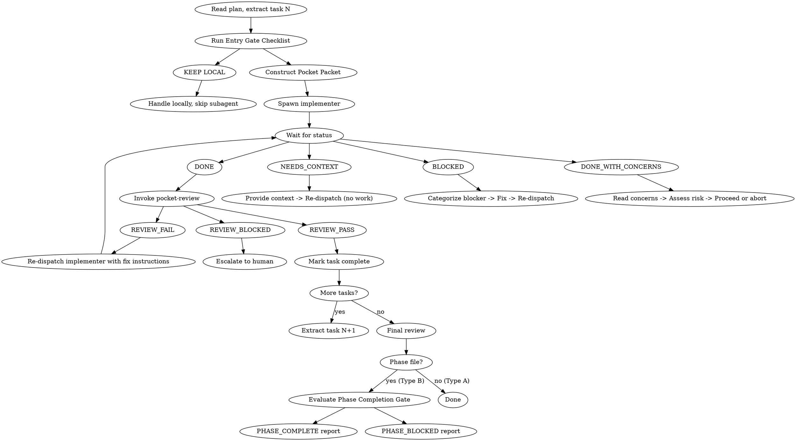

# Pocket Development

Precise subagent delegation for task-by-task development execution. POCKET ensures every delegation has a complete contract (Pocket Packet) that specifies exactly what must be done, how to verify it, and when to escalate.

**Core principle:** Every delegation is a contract. The packet is the contract. No packet, no spawn.

## Startup: Initialize Execution Log

**Run this before the first task, every session:**

```bash
# Ensure pocket scripts are in PATH (auto-installs on first use)
if ! command -v pocket-log-init &>/dev/null; then
  _src="$(find ~/.claude/plugins/cache -maxdepth 7 -name 'pocket-log-init' -type f 2>/dev/null | head -1)"
  if [ -n "$_src" ]; then
    mkdir -p ~/.local/bin
    _dir="$(dirname "$_src")"
    cp "$_dir"/pocket-log-* "$_dir"/pocket-structure ~/.local/bin/ 2>/dev/null
    chmod +x ~/.local/bin/pocket-log-* ~/.local/bin/pocket-structure 2>/dev/null
    export PATH="$HOME/.local/bin:$PATH"
  fi
fi

ls <plan_dir>/log.json 2>/dev/null || \
  pocket-log-init <plan_dir>
```

Replace `<plan_dir>` with the folder containing your `execution-plan.md` or `execution-plan-phase-N.md` file (e.g. `docs/pocket/plans/2026-05-08-auth-refactor`).

- If `log.json` exists → continue
- If not → script creates it automatically from the plan files in that directory

Full script reference and update/close commands: see **Execution Log** section below.

---

## When to Use

Use POCKET when ALL conditions are met:
- You have an implementation plan with 2+ independent tasks
- Tasks can be executed one-by-one (not requiring tight coupling)
- You need to delegate work to subagents

**Decision flow:**
```
Have implementation plan?
    │
    ├── Tasks mostly independent?
    │       │
    │       ├── YES → Use POCKET (this skill)
    │       │
    │       └── NO  → Manual execution or redesign plan
    │
    └── NO  → Use pocket-planning skill first (requires a spec from pocket-grinding)
```

## Input Types

pocket-development receives two distinct input formats. Identify which type before proceeding.

**Type A — Flat plan** (`execution-plan.md`)
- Produced by pocket-planning directly (≤6 tasks) or pocket-structuring pass-through
- No phase metadata in header
- Proceed normally through Entry Gate

**Type B — Phase file** (`execution-plan-phase-N.md`)
- Produced by pocket-structuring for plans with ≥7 tasks
- Header contains: `Phase N of M`, `Prerequisite`, `Contains tasks`, `Unlocks next`, `## Phase Completion Gate`
- **Before any task execution:**
  1. Extract phase metadata from header: Phase N of M, prerequisite status, task list
  2. Confirm `**Prerequisite:** Phase N-1 must be COMPLETE` is satisfied
  3. If prerequisite NOT confirmed COMPLETE → STOP. Report: `PHASE_BLOCKED: Phase N of M | Prerequisite phase not confirmed complete. Verify Phase N-1 gate before proceeding.`
- Track "Phase N of M" context throughout execution — surface it in all status reports
- Terminal step is a structured PHASE_COMPLETE or PHASE_BLOCKED report (see Phase Completion Protocol)

## 6 Iron Laws (MANDATORY)

These are non-negotiable. Violating any iron law leads to degraded delegation quality.

```
1. NO PACKET = NO SPAWN
   Never delegate without a structured Pocket Packet.
   WHY: The packet is the contract. Without it, expectations are unclear
   and subagents fill gaps with guesses.

2. NO SKIP THE GATE
   Entry gate checklist must pass before any spawn.
   WHY: Gate prevents unbounded tasks, wrong task type, and
   ambiguous prompts from reaching subagents.

3. NO TRUST WITHOUT EVIDENCE
   Always verify via read-only review.
   WHY: Subagent reports are self-assessments. Only read-only explore
   agents can verify actual code state.

4. NO AMBIGUOUS PROMPT
   Every prompt follows sandwich structure + attention rules.
   WHY: LLMs have attention drift. Sandwich structure places critical
   content at high-attention positions (start/end).

5. NO SILENT ESCALATION
   Every BLOCKED/NEEDS_CONTEXT has explicit reason + next action.
   WHY: "I'm stuck" without reason creates deadlock. Every status
   must include: what's blocked, why, and what would unblock.

6. NO SILENT REFERENCE
   Every decision (task scope, verification approach, routing choice) must cite
   the specific reference that informed it.
   WHY: Without citation, we cannot audit decision quality or train improved judgment.
   HOW: Before constructing any packet or making routing decisions, load the
   relevant reference file(s) and cite the file in the Pocket Packet under SANDWICH CONTEXT.
```

## Entry Gate Checklist

Before dispatching any subagent, ALL items must pass.

**Phase File Pre-Gate** (Type B input only — fires before items 1–6):
```
0. PHASE FILE CHECK
   - Input is execution-plan-phase-N.md?
   - If YES: phase metadata extracted? (N of M, prerequisite, task list, Completion Gate)
   - Prerequisite phase confirmed COMPLETE?
   FAIL → STOP. Emit PHASE_BLOCKED with prerequisite reason. Do not proceed to item 1.
```

```
1. TASK BOUNDED?
   - Scope clear? Deliverables defined? Stop conditions known?
   - NOT: "implement auth" but "Extract auth layer to auth_service.py"
   FAIL → KEEP LOCAL with reason

2. REFERENCES LOADED?
   - Relevant reference files read and cited in packet?
   - Packet includes REFERENCES LOADED section?
   FAIL → LOAD REFERENCES first, then reconstruct packet

3. PACKET CONSTRUCTIBLE?
   - Can you write a precise 7-field packet?
   - Must have: specific objective, exact verification criteria
   FAIL → KEEP LOCAL until task is clearer

4. TASK TYPE CLEAR?
   - Task = implementation → proceed with packet construction
   - Task = review/audit → route to review workflow
   UNCLEAR → Clarify task type before proceeding

5. PROMPT SANDWICH?
   - Critical instruction at START?
   - Key constraint at END?
   - Middle section free of filler/padding?
   FAIL → Restructure before spawn

6. VERIFICATION DEFINED?
   - Know exact criteria for "done"?
   - Can write 3-5 verification checklist items?
   FAIL → Define before spawn

ANY "NO" → KEEP LOCAL with reason written in task notes
```

## Mandatory Reference Preloading

Before constructing any Pocket Packet, you MUST load the relevant reference file(s) and cite them in your packet. This enforces Iron Law #6: NO SILENT REFERENCE.

| Task/Situation | Mandatory References to Load |
|----------------|------------------------------|
| Packet construction | `references/pocket-packet.md`, `references/sandwich-prompt.md` |
| Task decomposition unclear | `references/task-decomposition.md` |
| Entry gate fails | `references/entry-gate.md`, `references/iron-laws.md` |
| Status is BLOCKED/NEEDS_CONTEXT | `references/status-handling.md` |

### Citation Requirement

In every Pocket Packet, you MUST include a `REFERENCES LOADED` section:

```markdown
## REFERENCES LOADED
[Reference file name] — [Brief summary of what was learned]
[Reference file name] — [Brief summary of what was learned]
```

**Example:**
```markdown
## REFERENCES LOADED
references/task-decomposition.md — Guidelines for splitting complex tasks into bounded subtasks.
```

[CRITICAL] Without this citation, the Pocket Packet is incomplete and cannot proceed to spawn.

## Pocket Packet Structure

Every subagent spawn requires this 7-field structure:

```markdown
## OBJECTIVE
[Single bounded task - what MUST be done, not approach]

## REFERENCES LOADED
[Reference file name] — [Brief summary of what was learned]
[Reference file name] — [Brief summary of what was learned]
[CRITICAL: Without this section, packet is incomplete]

## WHY THIS APPROACH
[Justification for task scope and approach selection]
[Complexity assessment and any constraints that inform execution strategy]

## SANDWICH CONTEXT
[CRITICAL CONSTRAINT]      ← FIRST LINE, highest attention
[Role + Task + Constraint]
[Scene-setting: where fits, dependencies]
[Technical context needed]
[Key constraint REPEATED]   ← near END for long outputs

## DELIVERABLE
[Exact output format - Few-Shot example if format matters]
[Verification checklist - 3-5 specific items]

## QUALITY BAR
[Must-have | Must-not-have | Red flags to catch]

## STOP CONDITIONS
[Done when X | Uncertain when Y | Escalate when Z]
```

## Worked Example: User Service Refactoring

**Task:** Extract authentication layer from monolithic user_service.py

```markdown
## OBJECTIVE
Extract authentication logic from user_service.py into a new auth_service.py file.
Move: login(), logout(), verify_token(), refresh_token() functions.
Update imports in user_service.py to use auth_service.

## REFERENCES LOADED
references/pocket-packet.md — 9-field packet structure, must include REFERENCES LOADED section
references/sandwich-prompt.md — Critical constraint in FIRST LINE, repeat near END for long outputs
[CRITICAL: Without REFERENCES LOADED, packet is incomplete]

## WHY THIS APPROACH
[Integration task requiring multi-file changes with judgment calls]
[Standard complexity — requires cross-file coordination]

## SANDWICH CONTEXT
[CRITICAL: Do NOT modify any business logic, only extract and relocate]
You are implementing auth layer extraction for user service refactoring.
Files: user_service.py (source), auth_service.py (create), any tests
Dependencies: Must maintain existing function signatures
[key constraint: Auth logic stays identical, only location changes]

## DELIVERABLE
1. Create auth_service.py with extracted functions
2. Update user_service.py imports
3. Run existing tests → all must pass
4. Verify: git diff shows only relocations, no logic changes

## QUALITY BAR
Must-have:
  - All 4 auth functions in auth_service.py
  - Original function signatures preserved
  - user_service.py imports from auth_service
  - Test files updated if import paths changed

Must-not-have:
  - Any auth logic modifications
  - New dependencies added
  - Tests bypassed or modified

Red flags:
  - "While extracting, I improved the code" → REVERT
  - Missing function signatures → FIX

## STOP CONDITIONS
Done when: auth_service.py exists, tests pass, no logic changes
Uncertain when: Test failures after extraction
Escalate when: Auth logic intertwined with user data access
```

## Delegation Strategy

### Task Type Selection

| Task | Workflow | Access |
|------|----------|--------|
| **Implementation** | Delegate to implementer | Read + Write |
| **Review** | `pocket-review` skill | Read-only |

### Complexity Assessment

Match execution approach to task complexity:

| Task Complexity | Approach | Example |
|-----------------|----------|---------|
| **Mechanical** (1-2 files, clear spec) | Lightweight delegation | Move function, rename, simple refactor |
| **Standard** (2-5 files, some judgment) | Standard delegation | Extract module, restructure imports |
| **Architectural** (complex, high judgment) | Deep delegation with oversight | Design patterns, major refactors |

### When to Escalate

- Reasoning errors → Add constraints or split into smaller packets
- Context window overflow → Split into smaller packets
- Hallucination issues → Add specific constraints

## The Process



## Sandwich Prompt Rules

Every subagent prompt must follow these attention mechanics:

```
RULE 1: Critical instruction in FIRST LINE (U-shaped attention peak)
        → LLM attention is highest at start
        → Example: [CRITICAL: Auth logic must not change]

RULE 2: Key constraint REPEATED near END (counters attention drift)
        → For outputs >500 tokens, restate constraint before output
        → Example: [REPEAT: No auth logic modifications]

RULE 3: Middle section FREE of filler/padding
        → No "Certainly!", "Of course!", "Here's what I'll do:"
        → Direct instructions only

RULE 4: For long outputs, restate constraint before output section
        → Prevents mid-output attention drift

TEMPLATE:
[CRITICAL: worst-case if violated]
You are implementing [task]

[Context - scene setting, dependencies, technical]

[RESTATE KEY CONSTRAINT]  ← for long outputs

Your job:
1. [step]
2. [step]

Report: DONE | DONE_WITH_CONCERNS | NEEDS_CONTEXT | BLOCKED
```

## Method Selection

Match prompting complexity to task complexity:

| Task Type | Method | Tokens |
|-----------|--------|--------|
| Simple, well-specified | Zero-Shot | 50-200 |
| Format consistency needed | Few-Shot (2-3 examples) | 200-800 |
| Multi-step reasoning | Chain of Thought | 100-500 |
| Complex planning | Tree of Thoughts | 500-2000+ |
| High-stakes verification | Self-Consistency | 500-3000+ |
| Tool use required | ReAct | 300-1000 |

## Review

Review is handled by the `pocket-review` skill. When implementer reports DONE:

1. Extract task context from phase file (DELIVERABLE, QUALITY_BAR, files_changed)
2. Build input for pocket-review: plan_dir, phase_file, task_id, task_name, files_changed, spec_ref (absolute path to spec file), quality_bar, concerns, review_loop_limit, current_cycle
3. Invoke `pocket-review` skill with task context
4. pocket-review writes review report to `<plan_dir>/reviews/<task_id>-cycle-<N>.json` and returns: `REVIEW_PASS` | `REVIEW_FAIL` | `REVIEW_BLOCKED`
5. On REVIEW_FAIL: read `fix_instructions` from the review report JSON, pass verbatim to implementer in next Pocket Packet under "FIX INSTRUCTIONS FROM REVIEW" section
6. On REVIEW_BLOCKED: read `fix_instructions` from review report for human context, escalate to human, halt phase

**DONE_WITH_CONCERNS handling:** If implementer reported DONE_WITH_CONCERNS, assess concerns first. If correctness risk → address before invoking pocket-review. If observation only → proceed to pocket-review (concerns will be re-assessed during Stage 1).

See `pocket-review` skill for full two-stage review protocol (spec compliance → code quality), review loop, and escalation handling.

## Status Handling

| Status | Controller Action |
|--------|-------------------|
| **DONE** | Invoke pocket-review skill |
| **DONE_WITH_CONCERNS** | Read concerns → Assess risk → Proceed or abort |
| **NEEDS_CONTEXT** | Provide context → Re-dispatch (NO work until answered) |
| **BLOCKED** | Categorize blocker type → Fix → Re-dispatch |

### BLOCKED Categorization

| Blocker Type | Action |
|--------------|--------|
| Context problem | Provide more context |
| Reasoning needs | Escalate review depth |
| Task too large | Split into smaller packets |
| Plan wrong | Escalate to human |

Every BLOCKED status must include:
1. What's blocked (specific)
2. Why it's blocked (root cause)
3. What would unblock it (action)

**Bundle escalation (Type B phase files):** If BLOCKED is unresolvable within pocket-development, emit `PHASE_BLOCKED` (see Phase Completion Protocol) and halt. Do not silently continue or skip the blocked task.

## Execution Log

Three scripts manage the log — agent runs commands, no inline file editing. Applies to all plans; Script 3 (close) is Type B only.

### Script 2 — Update status

Update a **phase**:
```bash
pocket-log-update <plan_dir> <phase_file> <status>
```

Update a **task within a phase** (add `--task <task_id>`):
```bash
pocket-log-update <plan_dir> <phase_file> <status> --task T1
```

Status values (phase and task): `WAITING` → `REVIEW` → `DONE` | `BLOCKED`

### Script 3 — Close (after all phases complete)

```bash
pocket-log-close <plan_dir>
```

Verifies all phases DONE, sets header `status=DONE` + `date_completed`. Exits non-zero if any phase not DONE.

### When to run

| Moment | Command |
|--------|---------|
| Session start (no `log.json`) | Script 1 — see **Startup** section above |
| Session start (log.json exists, tasks missing) | Script 1 — auto-migrates tasks into existing phases |
| Implementer returns DONE for a task → entering review | Script 2 `--task TN` → `REVIEW` |
| Two-stage review passes for a task | Script 2 `--task TN` → `DONE` |
| All tasks in phase DONE → entering phase review | Script 2 (phase) → `REVIEW` |
| Phase review passes | Script 2 (phase) → `DONE` |
| Unresolvable BLOCKED (task or phase) | Script 2 → `BLOCKED` |
| All phases complete (Type B only) | Script 3 (close) |

`log.json` lives in `docs/pocket/plans/{slug}/log.json` — this is pocket-closing's primary input.

---

## Phase Completion Protocol

Activates **only for Type B input** (execution-plan-phase-N.md). Runs after all tasks reach DONE/DONE_WITH_CONCERNS and both review stages pass.

**Step 1 — Evaluate Phase Completion Gate** (copy conditions verbatim from phase file `## Phase Completion Gate`):
```
[ ] Every task in this phase: status DONE
[ ] All tests pass
[ ] All commits created with correct format
[ ] No task has status BLOCKED or NEEDS_CONTEXT
```

**Step 2 — Emit structured report:**

If all conditions pass:
```
PHASE_COMPLETE: Phase N of M
Tasks: [T1, T2, T4] — all DONE
Commits: [commit message list]
Tests: green
Gate: PASS
→ pocket-structuring may proceed to Phase N+1
```

If any condition fails:
```
PHASE_BLOCKED: Phase N of M
Failed gate condition: [which condition]
Blocked task: TN | Blocker category: [type]
Unblocking action: [specific required action]
→ Do NOT proceed to Phase N+1
```

This report is the signal pocket-structuring polls for in its Handoff Protocol ("wait for explicit DONE confirmation").

---

## Pressure Countermeasures

When delegation pressure threatens to bypass structure:

| Pressure | Countermeasure |
|----------|----------------|
| **TIME** | Cut niceties, not structure. Packet still required. |
| **SUNK COST** | Rewrite packet anyway. Bad packets must be rewritten. |
| **AUTHORITY** | Keep the law, not the shortcut. Process protects quality. |
| **EXHAUSTION** | Refuse delegation if packet cannot stay legible. KEEP LOCAL. |

## Red Flags

**Never do:**
- Delegate without a Pocket Packet
- Skip the Entry Gate Checklist
- Trust a subagent's report without verification (use explore reviewers)
- Give ambiguous prompts ("handle X", "fix Y")
- Skip review loops after finding issues
- Proceed with BLOCKED status without categorizing
- Accept vague escalation ("I'm stuck" without reason)

**If agent asks questions:**
- Answer clearly and completely
- Provide additional context if needed
- Don't rush into implementation

**If reviewer finds issues:**
- Implementer fixes them
- Reviewer reviews again
- Repeat until approved

## Reference Triggers

Load these reference files when SKILL.md says "see reference for details" or when you encounter edge cases. **Per Iron Law #6, you must cite which reference was loaded in every Pocket Packet.**

| Reference | When to Load | What You'll Learn |
|-----------|--------------|-------------------|
| `references/iron-laws.md` | Iron laws enforcement details or pressure countermeasure specifics | Full text of 6 iron laws with enforcement examples |
| `references/entry-gate.md` | Gate checklist fails, need decision matrix or KEEP LOCAL examples | Decision tree for gate pass/fail |
| `references/pocket-packet.md` | Packet construction unclear, need field-by-field guide | Complete field definitions with examples |
| `references/sandwich-prompt.md` | Need attention mechanic details or method selection | Sandwich structure variations |

| `references/status-handling.md` | BLOCKED/NEEDS_CONTEXT unclear, need categorization details | Blocker types and actions |

