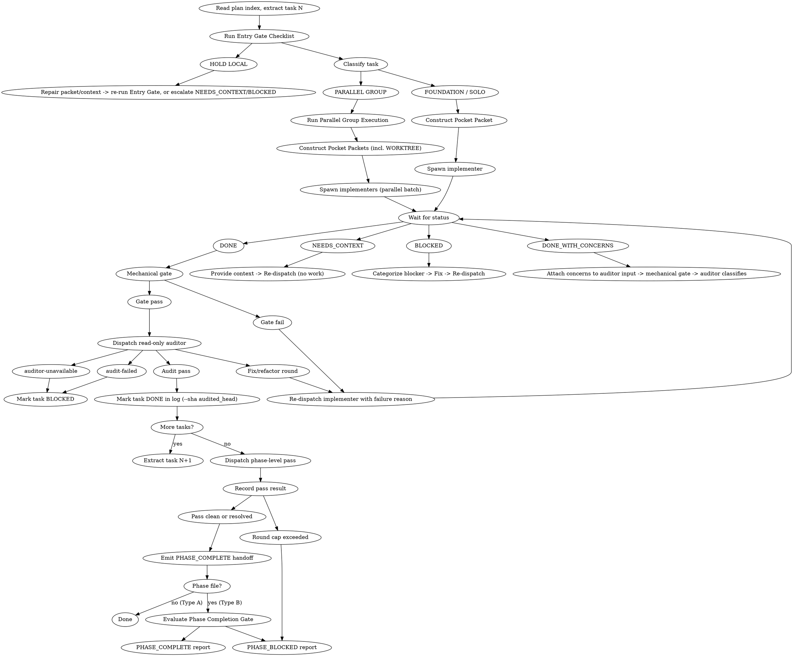

# Pocket Development

Precise subagent delegation for task-by-task development execution. POCKET ensures every delegation has a complete contract (Pocket Packet) that specifies exactly what must be done, how to verify it, and when to escalate.

**Core principle:** Every delegation is a contract. The packet is the contract. No packet, no spawn. Read `execution-plan/index.md` once to understand execution flow and dependencies, then open individual task files (`execution-plan/tasks/T*-*.md`) on demand when a task is ready to execute.

## Startup: Initialize Execution Log

**Run this before the first task, every session:**

```bash
npx -y pocketto-pi log init "<plan_dir>" --json --contract 2
```

No install step, PATH setup, or shell-specific guard — `npx` resolves the cross-platform binary and `log init` is idempotent, so this is safe to run unconditionally every session. Replace `<plan_dir>` with the folder containing your execution plan (e.g. `docs/pocket/plans/2026-05-08-auth-refactor`).

- No `log.json` yet → creates it from the plan files in that directory
- `log.json` exists but tasks missing → migrates tasks into existing phases (status preserved)
- `log.json` already complete → reports "no migration needed" and writes nothing

Full command reference and update/close commands: see **Execution Log** section below.

---

## When to Use

Use POCKET when ALL conditions are met:
- You have an implementation plan with 1+ tasks
- Tasks can be executed one-by-one (not requiring tight coupling)
- You need to delegate work to subagents

Task count does not gate eligibility. `pocket-planning` routes **every** plan through
`pocket-structuring`, which accepts any task count, so a one-task plan reaches here as a
legitimate Pocket plan. It is simply the degenerate case of `SOLO` — a group resolved to
size 1 — and runs the normal Entry Gate, packet, audit, and phase-pass path. Do not bounce
it to `hotfix`: `hotfix` is an entry-routing choice for small, clear work, not an escape
hatch once a full spec and plan already exist.

**Decision flow:**
```
Have implementation plan?
    │
    ├── Exactly one task?
    │       │
    │       └── YES → Use POCKET (this skill) — the task is SOLO
    │
    ├── Tasks mostly independent?
    │       │
    │       ├── YES → Use POCKET (this skill)
    │       │
    │       └── NO  → Manual execution or redesign plan
    │
    └── NO  → Use pocket-planning skill first (requires a spec from pocket-grinding)
```

## Input Types

pocket-development receives two distinct input formats. Identify which type before proceeding.

**Type A — Index manifest / Flat plan** (`execution-plan/index.md` or, on `OVERRIDE: skip structuring`, the legacy source `execution-plan.md`)
- Produced by pocket-planning / pocket-structuring (single-phase), or by the structuring override (flat source, no `execution-plan/` directory)
- Canonical path: read `execution-plan/index.md` once for summary, then open `execution-plan/tasks/T*-*.md` when starting each task
- Override/legacy path: read the flat source plan in full (context-cost accepted) — no per-task files
- Proceed normally through Entry Gate

**Type B — Phase file** (`execution-plan/phase-N.md` or legacy `execution-plan-phase-N.md`)
- Produced by pocket-structuring for plans with multiple phases
- Header contains: `Phase N of M`, `Prerequisite`, `Contains tasks`, `Unlocks next`, `## Phase Completion Gate`
- Reads `execution-plan/phase-N.md` for phase bounds, then opens `execution-plan/tasks/T*-*.md` on demand for each task
- **Before any task execution:**
  1. Extract phase metadata from header: Phase N of M, prerequisite status, task list
  2. Confirm `**Prerequisite:** Phase N-1 must be COMPLETE` is satisfied
  3. If prerequisite NOT confirmed COMPLETE → STOP. Report: `PHASE_BLOCKED: Phase N of M | Prerequisite phase not confirmed complete. Verify Phase N-1 gate before proceeding.`
- Track "Phase N of M" context throughout execution — surface it in all status reports
- Terminal step is a structured PHASE_COMPLETE or PHASE_BLOCKED report (see Phase Completion Protocol)

## Main Agent Role (HARDENED)

Main agent = **Delegator + Auditor only**. This is non-negotiable. Auditor here means: run the mechanical gate and dispatch the read-only auditor subagent — never judge code. Cite `references/two-stage-review.md`.

| Main agent MUST | Main agent MUST NOT |
|-----------------|---------------------|
| Initialize and update pocket log | Write, edit, or create implementation code |
| Construct Pocket Packets and dispatch subagents | Invoke a separate per-task review workflow — dispatch the in-loop auditor instead |
| Run the mechanical gate, then dispatch the read-only auditor | Judge code quality or spec compliance itself |
| Read task file `execution-plan/tasks/T*-*.md` on demand per task | Read full plan / all task files upfront (avoid context blowout) |
| Emit PHASE_COMPLETE handoff | Take over a task because "it's faster to do it myself" |

**Per-task review is the in-loop cycle (see [Review](#review)): mechanical gate, then a read-only auditor subagent. The main agent never judges code — every criterion is executed by that auditor. Cite `references/two-stage-review.md`.**

---

## 6 Iron Laws (MANDATORY)

These are non-negotiable. Violating any iron law leads to degraded delegation quality.

```
1. NO PACKET = NO SPAWN
   Never delegate without a structured Pocket Packet.
   WHY: The packet is the contract. Without it, expectations are unclear
   and subagents fill gaps with guesses.

2. NO SKIP THE GATE
   Entry gate checklist must pass before any spawn.
   WHY: Gate prevents unbounded tasks, wrong task type, and
   ambiguous prompts from reaching subagents.

3. NO TRUST WITHOUT EVIDENCE
   Always verify via read-only review.
   WHY: Subagent reports are self-assessments. Only read-only explore
   agents can verify actual code state.

4. NO AMBIGUOUS PROMPT
   Every prompt follows sandwich structure + attention rules.
   WHY: LLMs have attention drift. Sandwich structure places critical
   content at high-attention positions (start/end).

5. NO SILENT ESCALATION
   Every BLOCKED/NEEDS_CONTEXT has explicit reason + next action.
   WHY: "I'm stuck" without reason creates deadlock. Every status
   must include: what's blocked, why, and what would unblock.

6. NO SILENT REFERENCE
   Every decision (task scope, verification approach, routing choice) must cite
   the specific reference that informed it.
   WHY: Without citation, we cannot audit decision quality or train improved judgment.
   HOW: Before constructing any packet or making routing decisions, load the
   relevant reference file(s) and cite the file in the Pocket Packet under SANDWICH CONTEXT.
```

## Entry Gate Checklist

Run the normative Entry Gate Checklist verbatim from `references/entry-gate.md`.

**Summary of Pre-Gate & Items:**
0. **PHASE FILE CHECK** (Type B input only) — Phase metadata extracted and prerequisite phase confirmed COMPLETE?
1. **TASK BOUNDED?** — Read task file `execution-plan/tasks/TN-*.md` on demand when starting TN.
2. **PACKET CONSTRUCTIBLE?** — Can write precise 7-field packet (or 8-field with WORKTREE for PARALLEL GROUP)?
3. **TASK TYPE CLEAR?** — Implementation vs review/audit.
4. **PROMPT SANDWICH?** — Critical instruction at START, constraint at END.
5. **PARALLEL CLASSIFICATION** — Classify as Foundation, Solo, or Parallel Group.
6. **VERIFICATION DEFINED?** — Exact criteria for "done".

ANY "NO" → **HOLD LOCAL** with reason written in task notes.

`HOLD LOCAL` means *this task is not delegatable yet* — never "the main agent implements it".
The hardened role stands: repair the packet or the missing context locally, then re-run the
Entry Gate. If the task cannot be made delegatable, report `NEEDS_CONTEXT` or `BLOCKED` and
escalate. Controller bookkeeping (reading a task file, computing a SHA, fixing the packet) is
local work; writing, editing, or creating implementation code never is.

## Mandatory Reference Preloading

Before constructing any Pocket Packet, you MUST load the relevant reference file(s) and cite them in your packet. This enforces Iron Law #6: NO SILENT REFERENCE.

| Task/Situation | Mandatory References to Load |
|----------------|------------------------------|
| Packet construction | `references/pocket-packet.md`, `references/sandwich-prompt.md` |
| Entry gate fails | `references/entry-gate.md`, `references/iron-laws.md` |
| Plan has `[parallel: TX]` annotations | `references/entry-gate.md` (classification rules) |
| Status is BLOCKED/NEEDS_CONTEXT | `references/status-handling.md` |
| Per-task in-loop audit (after implementer DONE) | `references/two-stage-review.md` |
| Phase completion — all tasks in phase DONE | `references/phase-level-pass.md` |
| Enterprise reporting at phase completion (after the phase is `REVIEW`) | `references/enterprise-reporting.md` |

### Citation Requirement

In every Pocket Packet, you MUST include a `REFERENCES LOADED` section:

```markdown
## REFERENCES LOADED
[Reference file name] — [Brief summary of what was learned]
[Reference file name] — [Brief summary of what was learned]
```

**Example:**
```markdown
## REFERENCES LOADED
references/entry-gate.md — Decision tree for gate pass/fail; Foundation/Parallel-Group/Solo classification rules.
```

[CRITICAL] Without this citation, the Pocket Packet is incomplete and cannot proceed to spawn.

## Pocket Packet Structure

Every subagent spawn requires this 7-field structure (plus an 8th `WORKTREE` field for tasks classified as PARALLEL GROUP at the Entry Gate — see [Parallel Group Execution](#parallel-group-execution)):

```markdown
## OBJECTIVE
[Single bounded task - what MUST be done, not approach]

## REFERENCES LOADED
[Reference file name] — [Brief summary of what was learned]
[Reference file name] — [Brief summary of what was learned]
[CRITICAL: Without this section, packet is incomplete]

## WHY THIS APPROACH
[Justification for task scope and approach selection]
[Complexity assessment and any constraints that inform execution strategy]

## SANDWICH CONTEXT
[CRITICAL CONSTRAINT]      ← FIRST LINE, highest attention
[Role + Task + Constraint]
[Scene-setting: where fits, dependencies]
[Technical context needed]
[Key constraint REPEATED]   ← near END for long outputs

## DELIVERABLE
[Exact output format - Few-Shot example if format matters]
[Verification checklist - 3-5 specific items]

## QUALITY BAR
[Must-have | Must-not-have | Red flags to catch]

## STOP CONDITIONS
[Done when X | Uncertain when Y | Escalate when Z]
```

### Behavioral Tasks: Preserve the Test Intent

Plans carry **test intent, not test source code** — planning owns the intent, development owns
the implementation. A behavioral task arrives with a test file, level, GWT intent, boundary to
exercise, test doubles, an `Expected RED` reason, and an exact command. Do not expect runnable
test code in the task file, and never treat its absence as an incomplete packet.

A task may contain **more than one RED cycle** — planning adds an extra
test → implement → refactor → commit cycle for each additional GWT scenario a task covers.

When constructing the implementer packet for a behavioral task:

1. **Copy every RED cycle's test intent into OBJECTIVE verbatim, in source order** — all seven
   fields per cycle. Never collapse two cycles into one, never drop a later cycle, and never
   substitute your own test design. Each dropped cycle is a GWT scenario that silently loses
   its coverage in the planning → development rewrite.
2. **The implementer writes the RED test from that intent**, at the specified file and level.
3. **RED is verified before any production code:** run the exact command, confirm it FAILS, and
   confirm the failure matches `Expected RED`. A pass — or a failure for a different reason —
   means the test does not prove the behavior; fix the test first.
4. Then GREEN (minimum to pass) → refactor while green → commit.
5. Repeat 2–4 for each remaining cycle, in order.

Field-by-field guidance → `references/pocket-packet.md`. Tasks marked
`[no-tdd — structural task]` are exempt from steps 2–5.

## Worked Example: User Service Refactoring

**Task:** Extract authentication layer from monolithic user_service.py

```markdown
## OBJECTIVE
Extract authentication logic from user_service.py into a new auth_service.py file.
Move: login(), logout(), verify_token(), refresh_token() functions.
Update imports in user_service.py to use auth_service.

## REFERENCES LOADED
references/pocket-packet.md — 7 mandatory fields; WORKTREE is an 8th field only for PARALLEL GROUP
references/sandwich-prompt.md — Critical constraint in FIRST LINE, repeat near END for long outputs
[CRITICAL: Without REFERENCES LOADED, packet is incomplete]

## WHY THIS APPROACH
[Integration task requiring multi-file changes with judgment calls]
[Standard complexity — requires cross-file coordination]

## SANDWICH CONTEXT
[CRITICAL: Do NOT modify any business logic, only extract and relocate]
You are implementing auth layer extraction for user service refactoring.
Files: user_service.py (source), auth_service.py (create), any tests
Dependencies: Must maintain existing function signatures
[key constraint: Auth logic stays identical, only location changes]

## DELIVERABLE
1. Create auth_service.py with extracted functions
2. Update user_service.py imports
3. Run existing tests → all must pass
4. Verify: git diff shows only relocations, no logic changes

## QUALITY BAR
Must-have:
  - All 4 auth functions in auth_service.py
  - Original function signatures preserved
  - user_service.py imports from auth_service
  - Test files updated if import paths changed

Must-not-have:
  - Any auth logic modifications
  - New dependencies added
  - Tests bypassed or modified

Red flags:
  - "While extracting, I improved the code" → REVERT
  - Missing function signatures → FIX

## STOP CONDITIONS
Done when: auth_service.py exists, tests pass, no logic changes
Uncertain when: Test failures after extraction
Escalate when: Auth logic intertwined with user data access
```

## Delegation Strategy

### Task Type Selection

| Task | Workflow | Access |
|------|----------|--------|
| **Implementation** | Delegate to implementer | Read + Write |
| **Review** | In-loop auditor subagent (`references/two-stage-review.md`) | Read-only |

### Complexity Assessment

Match execution approach to task complexity:

| Task Complexity | Approach | Example |
|-----------------|----------|---------|
| **Mechanical** (1-2 files, clear spec) | Lightweight delegation | Move function, rename, simple refactor |
| **Standard** (2-5 files, some judgment) | Standard delegation | Extract module, restructure imports |
| **Architectural** (complex, high judgment) | Deep delegation with oversight | Design patterns, major refactors |

### When to Escalate

- Reasoning errors → Add constraints or split into smaller packets
- Context window overflow → Split into smaller packets
- Hallucination issues → Add specific constraints

## The Process



## Parallel Group Execution

Activates when Entry Gate item 5 classifies tasks as PARALLEL GROUP. Subagents are spawned as twins/forks inheriting CWD; without isolation they collide on `git status`, `git log`, lockfiles, and shared registries. Worktree-per-task gives each subagent a clean checkout.

**Classification happens in `references/entry-gate.md`.** This section covers the execution mechanics once classification = PARALLEL GROUP.

### Worktree Setup (main agent, before dispatch)

Worktrees are **retained** on BLOCKED for diagnosis, so setup SHALL be resumable: a later
session must be able to re-enter a group without tripping over its own retained state.

```bash
parent_sha=$(git rev-parse HEAD)        # latest merged task or baseline

# One-time per repo (idempotent). Local execution metadata belongs in the repo's private
# exclude file, NOT in tracked .gitignore — mutating a tracked file leaves the main tree
# dirty for the whole run, collides with any task that also edits .gitignore, and survives
# cleanup.
grep -qxF '.worktree/' .git/info/exclude || echo '.worktree/' >> .git/info/exclude

# Clear metadata for worktrees whose directory was deleted out from under git.
git worktree prune

# Per task in the group — resume before create:
for task in group:
    if git worktree list --porcelain | grep -qx "worktree $(pwd)/.worktree/<task_id>"; then
        # Registered. Reuse only if it is this task's branch AND still based on the parent.
        [[ $(git -C .worktree/<task_id> branch --show-current) == "task/<task_id>" ]] \
            || BLOCKED: worktree_branch_mismatch
        git -C .worktree/<task_id> merge-base --is-ancestor $parent_sha HEAD \
            || BLOCKED: worktree_stale_parent
        REUSE
    elif git show-ref --verify --quiet refs/heads/task/<task_id>; then
        # Branch survived, directory did not — reattach, do not re-create the branch.
        git worktree add .worktree/<task_id> task/<task_id>
    elif [[ -e .worktree/<task_id> ]]; then
        # Path on disk but unregistered even after prune — foreign directory.
        BLOCKED: worktree_path_occupied
    else
        git worktree add .worktree/<task_id> -b task/<task_id> $parent_sha
    fi
```

`worktree_stale_parent` means a task merged after this worktree was created, so its base no
longer matches the group's parent. Recovery is explicit, never silent reuse: merge or discard
the retained branch, remove the worktree (`git worktree remove`), then re-run setup. Same for
`worktree_branch_mismatch` and `worktree_path_occupied` — report the category and stop.

Path: `<cwd>/.worktree/<task_id>` — conventional location, excluded via `.git/info/exclude` on
first parallel run so the main working tree stays clean.

### Pocket Packet — WORKTREE Field (parallel tasks only)

Sequential tasks: omit. Parallel tasks: required.

```markdown
## WORKTREE
Path:       <abs_path>/.worktree/<task_id>
Branch:     task/<task_id>
Parent SHA: <parent_sha>
[CRITICAL: ALL operations must run from this worktree.
 First action: `cd <abs_path>/.worktree/<task_id>`. Do NOT touch parent repo.]
```

SANDWICH CONTEXT enforces CWD twice (Iron Law #4):

```
FIRST LINE: [CRITICAL: cd <abs_worktree_path> BEFORE any file or git
             operation. Wrong CWD = audit fail.]

NEAR END:   [REPEAT: Final commit must land on branch task/<task_id>.
             Verify before reporting DONE:
               git -C <abs_worktree_path> branch --show-current]
```

### Parallel Dispatch

Dispatch ALL tasks in the group in ONE batch — single message containing N parallel Agent calls. Same batching the main agent uses when dispatching read-only auditors per `references/two-stage-review.md`.

**Never** dispatch sequentially within a group. Concurrency is the entire point.

### Per-Worktree Quick Audit (main agent)

When a subagent reports DONE, run the in-loop cycle against ITS worktree. Cite `references/two-stage-review.md` for every rule — do not restate them here. The main agent never judges code; every criterion is executed by a read-only auditor subagent.

1. **Mechanical gate** (main agent) — command-and-commit evidence only, inside the worktree:

```bash
WT=.worktree/<task_id>

# 1. CWD discipline — catches "subagent ignored cd"
[[ $(git -C $WT branch --show-current) == "task/<task_id>" ]] || AUDIT FAIL

# 2. At least one commit ahead of parent
[[ $(git -C $WT rev-list $parent_sha..HEAD --count) -gt 0 ]] || AUDIT FAIL

# 3. Commands — enumerated and executed per `references/two-stage-review.md` § Mechanical gate,
#    with $WT as cwd. That file is normative: every distinct exact command the task's RED
#    cycles specify must be green, not just the first.
```

Mechanical fail → re-dispatch implementer with same WORKTREE field. Do not dispatch the auditor. Worktree RETAINED.

2. **Deep audit** — dispatch a read-only auditor subagent against the worktree tip (see `references/two-stage-review.md`). The auditor writes the verdict artifact. The main agent reads labels from that artifact; it does not assess code.
3. **Fix/refactor round** — when the artifact requires a round, re-dispatch the implementer with the same WORKTREE field, then re-run the mechanical gate, then re-dispatch the auditor.
4. **Re-audit** — same auditor path as step 2, against the new worktree tip.

On `audit-failed` or `auditor-unavailable`, halt the group — no merge (see `references/two-stage-review.md`). Worktrees RETAINED.

Passing in-worktree audits proceed to Group Merge below. Do not pass `--sha` of the worktree tip.

### Group Merge (main agent, after ALL group tasks audit-pass)

Main agent performs merges sequentially in plan order from the main repo:

```bash
for task in group_in_plan_order:                    # T5 → T6 → T7
    git merge --no-ff task/<task_id> \
              -m "Merge <task_id> (parallel group)"

    # On conflict:
    #   git merge --abort
    #   → BLOCKED: category=parallel-conflict
    #       Reason:   <task_id> conflicts with already-merged <prev_task>
    #       Files:    <conflicting files>
    #       Unblock:  User decides resolution strategy
    #       Halt — worktrees retained for diagnosis (do NOT log update)

    # Merge succeeded → log THIS task NOW, before the next merge. HEAD is
    # this task's merge commit, so done_sha = that commit.
    npx -y pocketto-pi log update <plan_dir> <phase_file> DONE --task <task_id> --json --contract 2
```

[CRITICAL] One task per loop iteration: `git merge` then `log update`, then the
next task. NEVER merge the whole group first and log afterwards — every
`log update` would capture the final merge commit, collapsing all tasks onto a
single `done_sha`. That silently empties the `prev_sha..done_sha` diff range
for the 2nd+ task — the range the phase-level pass diffs per task
(`references/phase-level-pass.md`) and pocket-closing's owner-map attribution
depends on — so that content goes unreviewed and misattributed. The CLI
refuses a duplicate `done_sha` across sibling tasks in a phase
(`DUPLICATE_DONE_SHA`, exit 1, nothing written). Recover by re-running with
`--sha <that task's own merge commit>` (find it via `git log --merges
--oneline`); only for a task that legitimately produced no new commit, pass
`--allow-duplicate-sha` to record the duplicate anyway (the main agent writes
a REVIEW_PASS skip stub for it per `references/two-stage-review.md`).

Merge commit SHA becomes that task's `done_sha` in log.json — **schema stays linear**, keeping the phase-level pass's per-task diff ranges and pocket-closing's owner-map attribution intact.

### Cleanup (main agent, after group fully merged + logged)

```bash
for task in group:
    git worktree remove .worktree/<task_id>
    git branch -d task/<task_id>
```

If ANY task in the group is BLOCKED → NO cleanup of any worktree in that group. Diagnosability over tidiness.

### Risk Mitigations Built Into Flow

| Risk | Mitigation |
|------|------------|
| Subagent ignores `cd` instruction | Audit Step 1 verifies `branch --show-current` = `task/<task_id>`. Wrong branch = AUDIT FAIL — no human-trust gap |
| Lockfile / build artifact race | Each worktree builds independently. Shared caches (pnpm store, cargo target) are project-specific — handle in plan, not skill |
| `.worktree/` polluting repo | Excluded via `.git/info/exclude` on first parallel run (untracked, leaves the working tree clean), auto-removed after merge |
| Conflict mid-merge | Sequential merge in plan order + `--abort` + structured BLOCKED with file list |
| log.json schema drift | `done_sha = merge_sha` keeps log linear; phase-level pass diff ranges and pocket-closing's owner-map attribution stay intact |
| Misclassified parallel/sequential | Caught at Entry Gate item 5 (classification), not here |

### Sample Flow

```
Plan: T5, T6, T7 — parallel group after T4

1. T4 merged. parent = git rev-parse HEAD (= T4's done_sha)

2. Entry Gate items 1-4 pass for each task individually.
   Item 5 classifies all three as PARALLEL GROUP.

3. Worktree setup (resume-before-create per task — see Worktree Setup):
   git worktree add .worktree/T5 -b task/T5 parent
   git worktree add .worktree/T6 -b task/T6 parent
   git worktree add .worktree/T7 -b task/T7 parent

4. Dispatch [T5, T6, T7] in ONE message — each packet has its WORKTREE field

5. All return DONE → mechanical gate then read-only auditor against each worktree tip → all pass

6. Main agent merges sequentially, logging each task BEFORE the next merge
   (one merge + one log update per iteration — never merge all three then log):
   git merge --no-ff task/T5  →  log update --task T5 DONE   # done_sha[T5] = T5 merge commit
   git merge --no-ff task/T6  →  log update --task T6 DONE   # done_sha[T6] = T6 merge commit
   git merge --no-ff task/T7  →  log update --task T7 DONE   # done_sha[T7] = T7 merge commit
   → each done_sha is a distinct merge commit; log stays linear

7. Cleanup: remove worktrees, delete branches

8. Continue to T9 (deps now satisfied)
```

## Sandwich Prompt Rules

Every subagent prompt must follow these attention mechanics:

```
RULE 1: Critical instruction in FIRST LINE (U-shaped attention peak)
        → LLM attention is highest at start
        → Example: [CRITICAL: Auth logic must not change]

RULE 2: Key constraint REPEATED near END (counters attention drift)
        → For outputs >500 tokens, restate constraint before output
        → Example: [REPEAT: No auth logic modifications]

RULE 3: Middle section FREE of filler/padding
        → No "Certainly!", "Of course!", "Here's what I'll do:"
        → Direct instructions only

RULE 4: For long outputs, restate constraint before output section
        → Prevents mid-output attention drift

TEMPLATE:
[CRITICAL: worst-case if violated]
You are implementing [task]

[Context - scene setting, dependencies, technical]

[RESTATE KEY CONSTRAINT]  ← for long outputs

Your job:
1. [step]
2. [step]

Report: DONE | DONE_WITH_CONCERNS | NEEDS_CONTEXT | BLOCKED
```

## Method Selection

Match prompting complexity to task complexity:

| Task Type | Method | Tokens |
|-----------|--------|--------|
| Simple, well-specified | Zero-Shot | 50-200 |
| Format consistency needed | Few-Shot (2-3 examples) | 200-800 |
| Multi-step reasoning | Chain of Thought | 100-500 |
| Complex planning | Tree of Thoughts | 500-2000+ |
| High-stakes verification | Self-Consistency | 500-3000+ |
| Tool use required | ReAct | 300-1000 |

## Review

Two distinct review phases. Do NOT conflate them.

### Per-Task In-Loop Audit (during execution)

When the implementer reports DONE, run the in-loop cycle. Cite `references/two-stage-review.md` for every rule — do not restate them here. The main agent never judges code; every criterion is executed by a read-only auditor subagent.

1. **Mechanical gate** (main agent) — command-and-commit evidence only. On failure, re-dispatch the implementer; do not dispatch the auditor.
2. **Deep audit** — dispatch a read-only auditor subagent. The auditor writes the verdict artifact. The main agent reads labels from that artifact; it does not assess code.
3. **Fix/refactor round** — when the artifact requires a round, re-dispatch the implementer, then re-run the mechanical gate, then re-dispatch the auditor.
4. **Re-audit** — same auditor path as step 2, against the new HEAD.
5. **DONE** — after a passing audit, `log update --task TN DONE --sha <audited_head>`.

On `audit-failed` or `auditor-unavailable`, mark the task BLOCKED (see `references/two-stage-review.md`). Do not start the next task.

**DONE_WITH_CONCERNS:** Record the concerns verbatim, run the mechanical gate, and attach them to the auditor dispatch — the auditor classifies them, not the main agent (`references/two-stage-review.md` § Auditor identity). A concern naming a missing architectural decision or absent context is a scope blocker, not a code judgement: escalate it as NEEDS_CONTEXT.

### End-of-Execution Handoff (after all tasks done)

After ALL tasks are marked DONE in the log, finish the phase in this exact order — **pass → record → `REVIEW` → report**:

1. **Dispatch the phase-level pass.** A read-only subagent over the whole phase: every task's `prev_sha..done_sha` diff range and packet, in plan order. The main agent computes and passes the ranges; it does not judge code. Contract: `references/phase-level-pass.md` — cite it; do not restate its rules here.
2. **Record the pass result.** The result lands at `<plan_dir>/reviews/phase-pass-<phase_key>.json` — `PHASE_PASS_CLEAN`, or `PHASE_PASS_RESOLVED` after its fix rounds, corrections, and verdict fan-out complete, all per `references/phase-level-pass.md`. Phase status is not `REVIEW` yet.
3. **Set phase status `REVIEW`.** Only now, and only for a pass that recorded a terminal clean/resolved result:
   ```bash
   npx -y pocketto-pi log update <plan_dir> <phase_file> REVIEW --json --contract 2
   ```
   If the pass exceeded its round cap, this command is forbidden — the phase is `PHASE_BLOCKED` instead (see [Phase Completion Protocol](#phase-completion-protocol)).
4. **Emit the handoff message, then run enterprise reporting.** Emit the message below, then execute the E1–E6 steps exactly as specified in `references/enterprise-reporting.md` (fail-closed preflight, PR discovery including its `create-pr` offer, summary upsert, inline-findings reconcile). Cite the reference; do not restate or duplicate its steps — including its offer semantics.

```
PHASE_COMPLETE: All tasks marked DONE.

Phase-level pass: <PHASE_PASS_CLEAN | PHASE_PASS_RESOLVED> — recorded at
<plan_dir>/reviews/phase-pass-<phase_key>.json
Phase status: REVIEW

Next step (user-triggered):
Run: /pocketto:pocket-closing <plan_dir>/<phase_file>
```

`pocket-closing` owns everything after `REVIEW`; this skill never advances a phase beyond `REVIEW`.

**Pocket Enterprise — task checklist sync (same fail-closed guard).** Only when the enterprise preflight passed (step 4, `references/enterprise-reporting.md`), after enterprise reporting, sync the live task checklist to the linked GitHub issue:

1. Resolve `spec_dir` = `docs/pocket/spec/<slug>/` where `<slug>` matches the plan directory basename, then read the linked issue:
   ```bash
   npx -y pocketto-pi meta get <spec_dir> github_issue.number --json --contract 2
   ```
   If `data.value` is null or missing, **or** the envelope is `ok:false` (e.g. `error.code == "NOT_FOUND"` — `spec_dir` doesn't exist) → emit one warning line `"Task checklist sync skipped: no linked issue in .pocket-meta.json."` and stop this step (no GitHub call).
2. Check `gh auth status` — not authenticated → emit one warning line and stop this step (the handoff itself already succeeded; never fail the phase over checklist sync).
3. Render the checklist body from `log.json`:
   ```bash
   npx -y pocketto-pi format tasklist <plan_dir> --json --contract 2
   ```
   Parse `data.bodyFile` and `data.marker` (`<!-- pocket-tasklist -->`).
4. Upsert exactly **one** marker-tagged comment on the issue (same marker-upsert pattern as E4 in `references/enterprise-reporting.md`). Resolve `<owner>/<repo>` via `gh repo view --json owner,name`, then:
   ```bash
   gh api repos/<owner>/<repo>/issues/<issue_number>/comments --paginate
   ```
   Filter comments whose `body` starts with the marker (first line), sorted by `id` ascending:

   | Matches | Action |
   |---------|--------|
   | 0 | Create: `gh api repos/<owner>/<repo>/issues/<issue_number>/comments -f body="$(cat <bodyFile>)"` |
   | 1 | Update in place: `gh api repos/<owner>/<repo>/issues/comments/<comment_id> --method PATCH -f body="$(cat <bodyFile>)"` |
   | >1 (race) | Update the earliest; delete the later duplicates |

   The GitHub issue now shows live per-phase task status — the team's progress view without any dashboard.

## Status Handling

| Status | Controller Action |
|--------|-------------------|
| **DONE** | Mechanical gate, then dispatch the read-only auditor (`references/two-stage-review.md`). On pass: `log update --task TN DONE --sha <audited_head>`. On gate fail: re-dispatch implementer. |
| **DONE_WITH_CONCERNS** | Attach concerns verbatim to the auditor input → mechanical gate → auditor classifies them. Scope/context blockers escalate as NEEDS_CONTEXT |
| **NEEDS_CONTEXT** | Provide context → Re-dispatch (NO work until answered) |
| **BLOCKED** | Categorize blocker type. In-loop categories `audit-failed` and `auditor-unavailable`: persist and halt (see `references/two-stage-review.md`). Other categories: Fix → Re-dispatch |
| **REVIEW_FAIL** (task verdict artifact) | Not a subagent return status — a verdict inside `reviews/<task_id>-review.json`. Fix it through the correction path in `references/phase-level-pass.md`: dispatch an implementer subagent for the fix (you stay Delegator + Auditor — never write the fix yourself), record it as an append-only correction, and refresh the affected tasks' verdict artifacts per its fan-out. `done_sha` NEVER moves. |

`REVIEW_FAIL` corrections are append-only and never touch `done_sha` (`references/phase-level-pass.md`). A fix made before a task's `done_sha` is pinned is an in-loop fix round (`references/two-stage-review.md`), not a correction.

**After ALL tasks DONE:** dispatch the phase-level pass, record its result, set the phase to `REVIEW`, then emit the PHASE_COMPLETE handoff naming `/pocketto:pocket-closing <plan_dir>/<phase_file>` as the user-triggered next step (see [End-of-Execution Handoff](#end-of-execution-handoff-after-all-tasks-done)). In enterprise mode, enterprise reporting (`references/enterprise-reporting.md`) and the task checklist sync run at that same point, after `REVIEW` is set.

### BLOCKED Categorization

| Blocker Type | Action |
|--------------|--------|
| Context problem | Provide more context |
| Reasoning needs | Escalate review depth |
| Task too large | Split into smaller packets |
| Plan wrong | Escalate to human |
| Parallel-conflict | Group merge failed — abort merge, escalate to user with conflicting file list, retain worktrees for diagnosis |

Every BLOCKED status must include:
1. What's blocked (specific)
2. Why it's blocked (root cause)
3. What would unblock it (action)

**Bundle escalation (Type B phase files):** If BLOCKED is unresolvable within pocket-development, emit `PHASE_BLOCKED` (see Phase Completion Protocol) and halt. Do not silently continue or skip the blocked task.

## Execution Log

The `pocketto-pi` CLI manages the log — the agent runs commands, no inline file editing. Applies to all plans; `log close` is Type B only. Every call takes `--json --contract 2`; parse `data` and check `ok`.

### `log update` — Update status

Update a **phase**:
```bash
npx -y pocketto-pi log update <plan_dir> <phase_file> <status> --json --contract 2
```

Update a **task within a phase** (add `--task <task_id>`):
```bash
npx -y pocketto-pi log update <plan_dir> <phase_file> <status> --task T1 --json --contract 2
```

Task status: `WAITING` → `DONE` | `BLOCKED`
Phase status: `WAITING` → `REVIEW` → `DONE` | `BLOCKED`

### `log close` — Close (after all phases complete)

```bash
npx -y pocketto-pi log close <plan_dir> --json --contract 2
```

Verifies all phases DONE, sets header `status=DONE` + `date_completed`. Returns `ok: false` (exit non-zero) if any phase is not DONE.

### When to run

| Moment | Command |
|--------|---------|
| Session start (no `log.json`) | `log init` — see **Startup** section above |
| Session start (log.json exists, tasks missing) | `log init` — auto-migrates tasks into existing phases |
| In-loop audit passes for a task | `log update --task TN DONE --sha <audited_head>` |
| Unresolvable BLOCKED (task) | `log update --task TN` → `BLOCKED` |
| After the phase-level pass records its result (all tasks already DONE) | `log update` (phase) → `REVIEW` |
| Phase-level pass exceeds its round cap (findings still outstanding — `references/phase-level-pass.md`) | `log update` (phase) → `BLOCKED` (PHASE_BLOCKED — must NOT reach `REVIEW`) |
| Unresolvable BLOCKED (phase) | `log update` (phase) → `BLOCKED` |
| All phases complete (Type B only) | `log close` |

**Phase-completion ordering:** dispatch the phase-level pass → record its result → set the phase to `REVIEW` → run enterprise reporting (`references/enterprise-reporting.md`). The `REVIEW` row above fires only after `reviews/phase-pass-<phase_key>.json` carries a terminal pass result — never before, and never for a pass that exceeded its round cap (`references/phase-level-pass.md`).

**IMPORTANT:** NEVER set task status to `DONE` before the in-loop audit completes and `--sha <audited_head>` is passed. NEVER set task status to `REVIEW` — that status is for phases only.

`log.json` lives in `docs/pocket/plans/{slug}/log.json` — this is pocket-closing's primary input.

---

## Phase Completion Protocol

Activates **only for Type B input** (execution-plan/phase-N.md). Runs after all tasks reach DONE/DONE_WITH_CONCERNS and their per-task in-loop audits pass.

**Ordering is fixed: dispatch the phase-level pass → record its result → set phase status `REVIEW` → run enterprise reporting (`references/enterprise-reporting.md`).** `PHASE_COMPLETE` may be emitted only after the phase-level pass has recorded its result.

**Step 1 — Run the phase-level pass, then evaluate the Phase Completion Gate.** Once every task is `DONE`, dispatch the phase-level pass and let it record its result at `<plan_dir>/reviews/phase-pass-<phase_key>.json` (contract: `references/phase-level-pass.md`). Then evaluate the gate — copy the phase file's `## Phase Completion Gate` conditions verbatim, plus the pass condition:
```
[ ] Every task in this phase: status DONE
[ ] All tests pass
[ ] All commits created with correct format
[ ] No task has status BLOCKED or NEEDS_CONTEXT
[ ] Phase-level pass recorded a terminal result at
    <plan_dir>/reviews/phase-pass-<phase_key>.json
    (PHASE_PASS_CLEAN or PHASE_PASS_RESOLVED — references/phase-level-pass.md)
```

**Step 2 — Set `REVIEW`, then emit the structured report:**

If all conditions pass — set the phase to `REVIEW` (`log update` (phase) → `REVIEW`, only now that the pass result is recorded), then report:
```
PHASE_COMPLETE: Phase N of M
Tasks: [T1, T2, T4] — all DONE
Commits: [commit message list]
Tests: green
Phase-level pass: <PHASE_PASS_CLEAN | PHASE_PASS_RESOLVED> at
  <plan_dir>/reviews/phase-pass-<phase_key>.json
Phase status: REVIEW
Gate: PASS
Next: user runs `/pocketto:pocket-closing <plan_dir>/<phase_file>`.
→ Phase N+1 may start only after pocket-closing reports this phase DONE
```

If any condition fails:
```
PHASE_BLOCKED: Phase N of M
Failed gate condition: [which condition]
Blocked task: TN | Blocker category: [type]
Unblocking action: [specific required action]
→ Do NOT proceed to Phase N+1
```

**Phase-level pass round cap exceeded:** if the pass ends with findings still outstanding, the phase is `PHASE_BLOCKED` — it MUST NOT reach `REVIEW`, and the pass record carries `status: "PHASE_BLOCKED"` with the outstanding findings (`references/phase-level-pass.md`). Report:
```
PHASE_BLOCKED: Phase N of M
Failed gate condition: Phase-level pass exceeded its round cap with findings outstanding
Pass record: <plan_dir>/reviews/phase-pass-<phase_key>.json (status PHASE_BLOCKED)
Outstanding findings: [from the pass record]
Unblocking action: human resolves the outstanding findings
→ Do NOT proceed to Phase N+1; phase status MUST NOT become REVIEW
```

This report tells pocket-structuring that the phase reached `REVIEW`; pocket-structuring then halts and directs the user to run `/pocketto:pocket-closing <plan_dir>/<phase_file>`, and proceeds to Phase N+1 only after pocket-closing reports the phase `DONE`.

---

## Pressure Countermeasures

When delegation pressure threatens to bypass structure:

| Pressure | Countermeasure |
|----------|----------------|
| **TIME** | Cut niceties, not structure. Packet still required. |
| **SUNK COST** | Rewrite packet anyway. Bad packets must be rewritten. |
| **AUTHORITY** | Keep the law, not the shortcut. Process protects quality. |
| **EXHAUSTION** | Refuse delegation if packet cannot stay legible. Stop and resume later — this is an operator condition, not a task defect, so it is not `HOLD LOCAL` and never authorizes implementing the task yourself. |

## Red Flags

**Main agent role violations (HARDENED — see [Main Agent Role](#main-agent-role-hardened) section):**
- Implement code yourself instead of delegating to a subagent
- Read full plan upfront instead of opening individual task files `execution-plan/tasks/T*-*.md` on demand
- Invoke a separate per-task review workflow — per-task review is the in-loop auditor (see `references/two-stage-review.md`)
- Mark task DONE in the log without a passing in-loop audit (mechanical gate + read-only auditor)
- Mark a task DONE without passing `--sha <audited_head>`

**Delegation violations:**
- Delegate without a Pocket Packet
- Skip the Entry Gate Checklist
- Trust a subagent's report without verification (mechanical gate, then dispatch the read-only auditor — the main agent never judges code)
- Give ambiguous prompts ("handle X", "fix Y")
- Proceed with BLOCKED status without categorizing
- Accept vague escalation ("I'm stuck" without reason)
- Dispatch a parallel group without creating worktrees first — collision risk on `git status`, `git log`, lockfiles, shared registries
- Merge a parallel group before ALL tasks in the group audit-pass — partial merges create ambiguous parent SHAs for the rest
- Merge the whole parallel group, THEN `log update` each task — every update captures the final merge commit, collapsing all tasks onto one `done_sha` and silently voiding their per-task review scope. Merge + log one task at a time. The CLI hard-errors on the duplicate (`DUPLICATE_DONE_SHA`); repair with `--sha <that task's own merge commit>`

**If agent asks questions:**
- Answer clearly and completely
- Provide additional context if needed
- Don't rush into implementation

**If reviewer finds issues:**
- Implementer fixes them
- Reviewer reviews again
- Repeat until approved

## Reference Triggers

Load these reference files when SKILL.md says "see reference for details" or when you encounter edge cases. **Per Iron Law #6, you must cite which reference was loaded in every Pocket Packet.**

| Reference | When to Load | What You'll Learn |
|-----------|--------------|-------------------|
| `references/iron-laws.md` | Iron laws enforcement details or pressure countermeasure specifics | Full text of 6 iron laws with enforcement examples |
| `references/entry-gate.md` | Gate checklist fails, need decision matrix or HOLD LOCAL examples, OR plan has `[parallel: TX]` annotations | Decision tree for gate pass/fail; Foundation/Parallel-Group/Solo classification rules |
| `references/pocket-packet.md` | Packet construction unclear, need field-by-field guide | Complete field definitions with examples |
| `references/sandwich-prompt.md` | Need attention mechanic details or method selection | Sandwich structure variations |
| `references/two-stage-review.md` | After implementer reports DONE; mechanical gate, auditor dispatch, fix/refactor, SHA pinning | Normative in-loop audit contract. Cite it; do not restate it. |
| `references/phase-level-pass.md` | All tasks in the phase are DONE — before the phase may become `REVIEW`, or a `REVIEW_FAIL` needs its correction path | Phase-level pass contract: dispatch, result record, round cap and PHASE_BLOCKED, append-only corrections, verdict fan-out. Cite it; do not restate it. |
| `references/enterprise-reporting.md` | Enterprise-mode phase completion, after the phase is `REVIEW` | E1–E6 verdict-posting steps behind the fail-closed mode preflight. Cite it; do not restate it. |
| `references/status-handling.md` | BLOCKED/NEEDS_CONTEXT unclear, need categorization details | Blocker types and actions |
