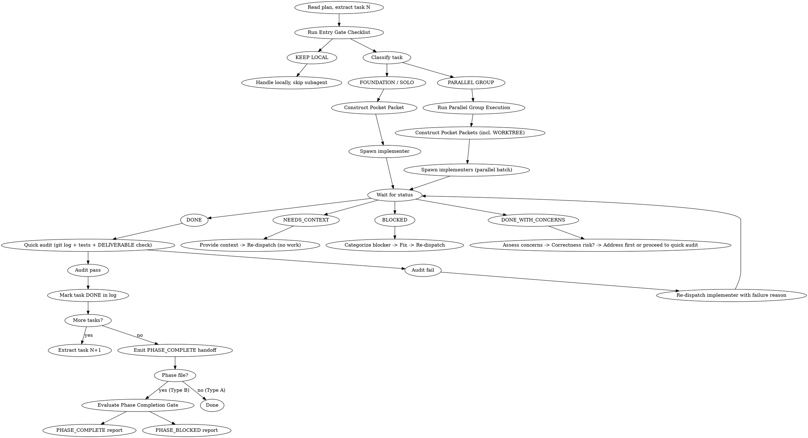

# Pocket Development

Precise subagent delegation for task-by-task development execution. POCKET ensures every delegation has a complete contract (Pocket Packet) that specifies exactly what must be done, how to verify it, and when to escalate.

**Core principle:** Every delegation is a contract. The packet is the contract. No packet, no spawn.

## Startup: Initialize Execution Log

**Run this before the first task, every session:**

```bash
# Ensure pocket scripts are in PATH (auto-installs on first use)
if ! command -v pocket-log-init &>/dev/null; then
  _src="$(find ~/.claude/plugins/cache -maxdepth 7 -name 'pocket-log-init' -type f 2>/dev/null | head -1)"
  if [ -n "$_src" ]; then
    mkdir -p ~/.local/bin
    _dir="$(dirname "$_src")"
    cp "$_dir"/pocket-log-* "$_dir"/pocket-structure ~/.local/bin/ 2>/dev/null
    chmod +x ~/.local/bin/pocket-log-* ~/.local/bin/pocket-structure 2>/dev/null
    export PATH="$HOME/.local/bin:$PATH"
  fi
fi

ls <plan_dir>/log.json 2>/dev/null || \
  pocket-log-init <plan_dir>
```

Replace `<plan_dir>` with the folder containing your `execution-plan.md` or `execution-plan-phase-N.md` file (e.g. `docs/pocket/plans/2026-05-08-auth-refactor`).

- If `log.json` exists → continue
- If not → script creates it automatically from the plan files in that directory

Full script reference and update/close commands: see **Execution Log** section below.

---

## When to Use

Use POCKET when ALL conditions are met:
- You have an implementation plan with 2+ independent tasks
- Tasks can be executed one-by-one (not requiring tight coupling)
- You need to delegate work to subagents

**Decision flow:**
```
Have implementation plan?
    │
    ├── Tasks mostly independent?
    │       │
    │       ├── YES → Use POCKET (this skill)
    │       │
    │       └── NO  → Manual execution or redesign plan
    │
    └── NO  → Use pocket-planning skill first (requires a spec from pocket-grinding)
```

## Input Types

pocket-development receives two distinct input formats. Identify which type before proceeding.

**Type A — Flat plan** (`execution-plan.md`)
- Produced by pocket-planning directly (≤6 tasks) or pocket-structuring pass-through
- No phase metadata in header
- Proceed normally through Entry Gate

**Type B — Phase file** (`execution-plan-phase-N.md`)
- Produced by pocket-structuring for plans with ≥7 tasks
- Header contains: `Phase N of M`, `Prerequisite`, `Contains tasks`, `Unlocks next`, `## Phase Completion Gate`
- **Before any task execution:**
  1. Extract phase metadata from header: Phase N of M, prerequisite status, task list
  2. Confirm `**Prerequisite:** Phase N-1 must be COMPLETE` is satisfied
  3. If prerequisite NOT confirmed COMPLETE → STOP. Report: `PHASE_BLOCKED: Phase N of M | Prerequisite phase not confirmed complete. Verify Phase N-1 gate before proceeding.`
- Track "Phase N of M" context throughout execution — surface it in all status reports
- Terminal step is a structured PHASE_COMPLETE or PHASE_BLOCKED report (see Phase Completion Protocol)

## Main Agent Role (HARDENED)

Main agent = **Delegator + Auditor only**. This is non-negotiable.

| Main agent MUST | Main agent MUST NOT |
|-----------------|---------------------|
| Initialize and update pocket log | Write, edit, or create implementation code |
| Construct Pocket Packets and dispatch subagents | Invoke `pocket-review` during execution (it's user-triggered post-phase) |
| Run quick audit after each implementer DONE | Do full two-stage review during development |
| Emit PHASE_COMPLETE handoff with pocket-review command | Take over a task because "it's faster to do it myself" |

**Full two-stage review (`pocket-review`) is user-triggered after ALL tasks are DONE — pocket-development does NOT invoke it. Per-task review during execution is a quick audit only (see [Review](#review) section).**

---

## 6 Iron Laws (MANDATORY)

These are non-negotiable. Violating any iron law leads to degraded delegation quality.

```
1. NO PACKET = NO SPAWN
   Never delegate without a structured Pocket Packet.
   WHY: The packet is the contract. Without it, expectations are unclear
   and subagents fill gaps with guesses.

2. NO SKIP THE GATE
   Entry gate checklist must pass before any spawn.
   WHY: Gate prevents unbounded tasks, wrong task type, and
   ambiguous prompts from reaching subagents.

3. NO TRUST WITHOUT EVIDENCE
   Always verify via read-only review.
   WHY: Subagent reports are self-assessments. Only read-only explore
   agents can verify actual code state.

4. NO AMBIGUOUS PROMPT
   Every prompt follows sandwich structure + attention rules.
   WHY: LLMs have attention drift. Sandwich structure places critical
   content at high-attention positions (start/end).

5. NO SILENT ESCALATION
   Every BLOCKED/NEEDS_CONTEXT has explicit reason + next action.
   WHY: "I'm stuck" without reason creates deadlock. Every status
   must include: what's blocked, why, and what would unblock.

6. NO SILENT REFERENCE
   Every decision (task scope, verification approach, routing choice) must cite
   the specific reference that informed it.
   WHY: Without citation, we cannot audit decision quality or train improved judgment.
   HOW: Before constructing any packet or making routing decisions, load the
   relevant reference file(s) and cite the file in the Pocket Packet under SANDWICH CONTEXT.
```

## Entry Gate Checklist

Before dispatching any subagent, ALL items must pass.

**Phase File Pre-Gate** (Type B input only — fires before items 1–6):
```
0. PHASE FILE CHECK
   - Input is execution-plan-phase-N.md?
   - If YES: phase metadata extracted? (N of M, prerequisite, task list, Completion Gate)
   - Prerequisite phase confirmed COMPLETE?
   FAIL → STOP. Emit PHASE_BLOCKED with prerequisite reason. Do not proceed to item 1.
```

```
1. TASK BOUNDED?
   - Scope clear? Deliverables defined? Stop conditions known?
   - NOT: "implement auth" but "Extract auth layer to auth_service.py"
   FAIL → KEEP LOCAL with reason

2. REFERENCES LOADED?
   - Relevant reference files read and cited in packet?
   - Packet includes REFERENCES LOADED section?
   FAIL → LOAD REFERENCES first, then reconstruct packet

3. PACKET CONSTRUCTIBLE?
   - Can you write a precise 7-field packet?
   - Must have: specific objective, exact verification criteria
   FAIL → KEEP LOCAL until task is clearer

4. TASK TYPE CLEAR?
   - Task = implementation → proceed with packet construction
   - Task = review/audit → route to review workflow
   UNCLEAR → Clarify task type before proceeding

5. PROMPT SANDWICH?
   - Critical instruction at START?
   - Key constraint at END?
   - Middle section free of filler/padding?
   FAIL → Restructure before spawn

6. VERIFICATION DEFINED?
   - Know exact criteria for "done"?
   - Can write 3-5 verification checklist items?
   FAIL → Define before spawn

ANY "NO" → KEEP LOCAL with reason written in task notes
```

## Mandatory Reference Preloading

Before constructing any Pocket Packet, you MUST load the relevant reference file(s) and cite them in your packet. This enforces Iron Law #6: NO SILENT REFERENCE.

| Task/Situation | Mandatory References to Load |
|----------------|------------------------------|
| Packet construction | `references/pocket-packet.md`, `references/sandwich-prompt.md` |
| Task decomposition unclear | `references/task-decomposition.md` |
| Entry gate fails | `references/entry-gate.md`, `references/iron-laws.md` |
| Plan has `[parallel: TX]` annotations | `references/entry-gate.md` (classification rules) |
| Status is BLOCKED/NEEDS_CONTEXT | `references/status-handling.md` |

### Citation Requirement

In every Pocket Packet, you MUST include a `REFERENCES LOADED` section:

```markdown
## REFERENCES LOADED
[Reference file name] — [Brief summary of what was learned]
[Reference file name] — [Brief summary of what was learned]
```

**Example:**
```markdown
## REFERENCES LOADED
references/task-decomposition.md — Guidelines for splitting complex tasks into bounded subtasks.
```

[CRITICAL] Without this citation, the Pocket Packet is incomplete and cannot proceed to spawn.

## Pocket Packet Structure

Every subagent spawn requires this 7-field structure (plus an 8th `WORKTREE` field for tasks classified as PARALLEL GROUP at the Entry Gate — see [Parallel Group Execution](#parallel-group-execution)):

```markdown
## OBJECTIVE
[Single bounded task - what MUST be done, not approach]

## REFERENCES LOADED
[Reference file name] — [Brief summary of what was learned]
[Reference file name] — [Brief summary of what was learned]
[CRITICAL: Without this section, packet is incomplete]

## WHY THIS APPROACH
[Justification for task scope and approach selection]
[Complexity assessment and any constraints that inform execution strategy]

## SANDWICH CONTEXT
[CRITICAL CONSTRAINT]      ← FIRST LINE, highest attention
[Role + Task + Constraint]
[Scene-setting: where fits, dependencies]
[Technical context needed]
[Key constraint REPEATED]   ← near END for long outputs

## DELIVERABLE
[Exact output format - Few-Shot example if format matters]
[Verification checklist - 3-5 specific items]

## QUALITY BAR
[Must-have | Must-not-have | Red flags to catch]

## STOP CONDITIONS
[Done when X | Uncertain when Y | Escalate when Z]
```

## Worked Example: User Service Refactoring

**Task:** Extract authentication layer from monolithic user_service.py

```markdown
## OBJECTIVE
Extract authentication logic from user_service.py into a new auth_service.py file.
Move: login(), logout(), verify_token(), refresh_token() functions.
Update imports in user_service.py to use auth_service.

## REFERENCES LOADED
references/pocket-packet.md — 9-field packet structure, must include REFERENCES LOADED section
references/sandwich-prompt.md — Critical constraint in FIRST LINE, repeat near END for long outputs
[CRITICAL: Without REFERENCES LOADED, packet is incomplete]

## WHY THIS APPROACH
[Integration task requiring multi-file changes with judgment calls]
[Standard complexity — requires cross-file coordination]

## SANDWICH CONTEXT
[CRITICAL: Do NOT modify any business logic, only extract and relocate]
You are implementing auth layer extraction for user service refactoring.
Files: user_service.py (source), auth_service.py (create), any tests
Dependencies: Must maintain existing function signatures
[key constraint: Auth logic stays identical, only location changes]

## DELIVERABLE
1. Create auth_service.py with extracted functions
2. Update user_service.py imports
3. Run existing tests → all must pass
4. Verify: git diff shows only relocations, no logic changes

## QUALITY BAR
Must-have:
  - All 4 auth functions in auth_service.py
  - Original function signatures preserved
  - user_service.py imports from auth_service
  - Test files updated if import paths changed

Must-not-have:
  - Any auth logic modifications
  - New dependencies added
  - Tests bypassed or modified

Red flags:
  - "While extracting, I improved the code" → REVERT
  - Missing function signatures → FIX

## STOP CONDITIONS
Done when: auth_service.py exists, tests pass, no logic changes
Uncertain when: Test failures after extraction
Escalate when: Auth logic intertwined with user data access
```

## Delegation Strategy

### Task Type Selection

| Task | Workflow | Access |
|------|----------|--------|
| **Implementation** | Delegate to implementer | Read + Write |
| **Review** | `pocket-review` skill | Read-only |

### Complexity Assessment

Match execution approach to task complexity:

| Task Complexity | Approach | Example |
|-----------------|----------|---------|
| **Mechanical** (1-2 files, clear spec) | Lightweight delegation | Move function, rename, simple refactor |
| **Standard** (2-5 files, some judgment) | Standard delegation | Extract module, restructure imports |
| **Architectural** (complex, high judgment) | Deep delegation with oversight | Design patterns, major refactors |

### When to Escalate

- Reasoning errors → Add constraints or split into smaller packets
- Context window overflow → Split into smaller packets
- Hallucination issues → Add specific constraints

## The Process



## Parallel Group Execution

Activates when Entry Gate item 5 classifies tasks as PARALLEL GROUP. Subagents are spawned as twins/forks inheriting CWD; without isolation they collide on `git status`, `git log`, lockfiles, and shared registries. Worktree-per-task gives each subagent a clean checkout.

**Classification happens in `references/entry-gate.md`.** This section covers the execution mechanics once classification = PARALLEL GROUP.

### Worktree Setup (main agent, before dispatch)

```bash
parent_sha=$(git rev-parse HEAD)        # latest merged task or baseline

# One-time per repo (idempotent):
grep -qxF '.worktree/' .gitignore || echo '.worktree/' >> .gitignore

# Per task in the group:
for task in group:
    git worktree add .worktree/<task_id> -b task/<task_id> $parent_sha
```

Path: `<cwd>/.worktree/<task_id>` — conventional location, auto-added to `.gitignore` of main branch on first parallel run.

### Pocket Packet — WORKTREE Field (parallel tasks only)

Sequential tasks: omit. Parallel tasks: required.

```markdown
## WORKTREE
Path:       <abs_path>/.worktree/<task_id>
Branch:     task/<task_id>
Parent SHA: <parent_sha>
[CRITICAL: ALL operations must run from this worktree.
 First action: `cd <abs_path>/.worktree/<task_id>`. Do NOT touch parent repo.]
```

SANDWICH CONTEXT enforces CWD twice (Iron Law #4):

```
FIRST LINE: [CRITICAL: cd <abs_worktree_path> BEFORE any file or git
             operation. Wrong CWD = audit fail.]

NEAR END:   [REPEAT: Final commit must land on branch task/<task_id>.
             Verify before reporting DONE:
               git -C <abs_worktree_path> branch --show-current]
```

### Parallel Dispatch

Dispatch ALL tasks in the group in ONE batch — single message containing N parallel Agent calls. Same pattern pocket-review uses for its review subagents.

**Never** dispatch sequentially within a group. Concurrency is the entire point.

### Per-Worktree Quick Audit (main agent)

When a subagent reports DONE, audit runs against ITS worktree:

```bash
WT=.worktree/<task_id>

# 1. CWD discipline — catches "subagent ignored cd"
[[ $(git -C $WT branch --show-current) == "task/<task_id>" ]] || AUDIT FAIL

# 2. At least one commit ahead of parent
[[ $(git -C $WT rev-list $parent_sha..HEAD --count) -gt 0 ]] || AUDIT FAIL

# 3. Tests (if plan specifies a test command) — inside worktree
git -C $WT <test_command>

# 4. DELIVERABLE checklist verified against worktree state
```

Audit fail → re-dispatch implementer with same WORKTREE field. Worktree RETAINED until audit passes.

### Group Merge (main agent, after ALL group tasks audit-pass)

Main agent performs merges sequentially in plan order from the main repo:

```bash
for task in group_in_plan_order:                    # T5 → T6 → T7
    git merge --no-ff task/<task_id> \
              -m "Merge <task_id> (parallel group)"

    # On conflict:
    git merge --abort
    → BLOCKED: category=parallel-conflict
      Reason:   <task_id> conflicts with already-merged <prev_task>
      Files:    <conflicting files>
      Unblock:  User decides resolution strategy
      Halt — worktrees retained for diagnosis
```

Merge commit SHA becomes that task's `done_sha` in log.json — **schema stays linear**, pocket-review preflight unchanged.

```bash
pocket-log-update <plan_dir> <phase_file> DONE --task <task_id>
# Captures HEAD (= merge_sha) as done_sha
```

### Cleanup (main agent, after group fully merged + logged)

```bash
for task in group:
    git worktree remove .worktree/<task_id>
    git branch -d task/<task_id>
```

If ANY task in the group is BLOCKED → NO cleanup of any worktree in that group. Diagnosability over tidiness.

### Risk Mitigations Built Into Flow

| Risk | Mitigation |
|------|------------|
| Subagent ignores `cd` instruction | Audit Step 1 verifies `branch --show-current` = `task/<task_id>`. Wrong branch = AUDIT FAIL — no human-trust gap |
| Lockfile / build artifact race | Each worktree builds independently. Shared caches (pnpm store, cargo target) are project-specific — handle in plan, not skill |
| `.worktree/` polluting repo | Auto-added to `.gitignore` on first parallel run, auto-removed after merge |
| Conflict mid-merge | Sequential merge in plan order + `--abort` + structured BLOCKED with file list |
| log.json schema drift | `done_sha = merge_sha` keeps log linear; pocket-review untouched |
| Misclassified parallel/sequential | Caught at Entry Gate item 5 (classification), not here |

### Sample Flow

```
Plan: T5, T6, T7 — parallel group after T4

1. T4 merged. parent = git rev-parse HEAD (= T4's done_sha)

2. Entry Gate items 1-4 pass for each task individually.
   Item 5 classifies all three as PARALLEL GROUP.

3. Worktree setup:
   git worktree add .worktree/T5 -b task/T5 parent
   git worktree add .worktree/T6 -b task/T6 parent
   git worktree add .worktree/T7 -b task/T7 parent

4. Dispatch [T5, T6, T7] in ONE message — each packet has its WORKTREE field

5. All return DONE → audit each in its worktree → all pass

6. Main agent merges sequentially:
   git merge --no-ff task/T5 → done_sha[T5] = HEAD
   git merge --no-ff task/T6 → done_sha[T6] = HEAD
   git merge --no-ff task/T7 → done_sha[T7] = HEAD

7. pocket-log-update for each → log stays linear

8. Cleanup: remove worktrees, delete branches

9. Continue to T9 (deps now satisfied)
```

## Sandwich Prompt Rules

Every subagent prompt must follow these attention mechanics:

```
RULE 1: Critical instruction in FIRST LINE (U-shaped attention peak)
        → LLM attention is highest at start
        → Example: [CRITICAL: Auth logic must not change]

RULE 2: Key constraint REPEATED near END (counters attention drift)
        → For outputs >500 tokens, restate constraint before output
        → Example: [REPEAT: No auth logic modifications]

RULE 3: Middle section FREE of filler/padding
        → No "Certainly!", "Of course!", "Here's what I'll do:"
        → Direct instructions only

RULE 4: For long outputs, restate constraint before output section
        → Prevents mid-output attention drift

TEMPLATE:
[CRITICAL: worst-case if violated]
You are implementing [task]

[Context - scene setting, dependencies, technical]

[RESTATE KEY CONSTRAINT]  ← for long outputs

Your job:
1. [step]
2. [step]

Report: DONE | DONE_WITH_CONCERNS | NEEDS_CONTEXT | BLOCKED
```

## Method Selection

Match prompting complexity to task complexity:

| Task Type | Method | Tokens |
|-----------|--------|--------|
| Simple, well-specified | Zero-Shot | 50-200 |
| Format consistency needed | Few-Shot (2-3 examples) | 200-800 |
| Multi-step reasoning | Chain of Thought | 100-500 |
| Complex planning | Tree of Thoughts | 500-2000+ |
| High-stakes verification | Self-Consistency | 500-3000+ |
| Tool use required | ReAct | 300-1000 |

## Review

Two distinct review phases. Do NOT conflate them.

### Per-Task Quick Audit (during execution)

When implementer reports DONE, main agent runs a quick audit inline — no subagent, no pocket-review:

1. Run `git log --oneline -5` — confirm a commit exists for this task
2. Run tests if the plan specifies a test command — confirm green
3. Check the packet's DELIVERABLE checklist — all items must be met

**Audit pass** → mark task DONE in log, proceed to next task.

**Audit fail** → re-dispatch implementer with specific failure reason:
```
AUDIT FAILED: [what failed — missing commit / failing tests / DELIVERABLE item N not met]
Fix this specific issue. Do not scope-creep.
```
Do NOT mark task DONE until audit passes.

**DONE_WITH_CONCERNS:** Assess concerns first. If correctness risk → address before running quick audit. If observation only → proceed with quick audit normally (concerns go into the final pocket-review phase).

### End-of-Execution Handoff (after all tasks done)

After ALL tasks are marked DONE in the log, emit a PHASE_COMPLETE handoff message. Do NOT invoke pocket-review directly.

```
PHASE_COMPLETE: All tasks marked DONE.

Full spec compliance + code quality review is a separate user-triggered step.

Run: /pocketto:pocket-review <plan_dir>/<phase_file>

pocket-review dispatches parallel reviewer subagents (one per task) and writes results to:
<plan_dir>/reviews/
```

## Status Handling

| Status | Controller Action |
|--------|-------------------|
| **DONE** | Quick audit (git log + tests + DELIVERABLE check) → mark task DONE if pass; re-dispatch with failure reason if fail |
| **DONE_WITH_CONCERNS** | Assess concerns → correctness risk: address first; observation only: proceed to quick audit |
| **NEEDS_CONTEXT** | Provide context → Re-dispatch (NO work until answered) |
| **BLOCKED** | Categorize blocker type → Fix → Re-dispatch |

**After ALL tasks DONE:** emit PHASE_COMPLETE handoff with the `/pocketto:pocket-review <plan_dir>` command. Do NOT invoke pocket-review directly — it is user-triggered.

### BLOCKED Categorization

| Blocker Type | Action |
|--------------|--------|
| Context problem | Provide more context |
| Reasoning needs | Escalate review depth |
| Task too large | Split into smaller packets |
| Plan wrong | Escalate to human |
| Parallel-conflict | Group merge failed — abort merge, escalate to user with conflicting file list, retain worktrees for diagnosis |

Every BLOCKED status must include:
1. What's blocked (specific)
2. Why it's blocked (root cause)
3. What would unblock it (action)

**Bundle escalation (Type B phase files):** If BLOCKED is unresolvable within pocket-development, emit `PHASE_BLOCKED` (see Phase Completion Protocol) and halt. Do not silently continue or skip the blocked task.

## Execution Log

Three scripts manage the log — agent runs commands, no inline file editing. Applies to all plans; Script 3 (close) is Type B only.

### Script 2 — Update status

Update a **phase**:
```bash
pocket-log-update <plan_dir> <phase_file> <status>
```

Update a **task within a phase** (add `--task <task_id>`):
```bash
pocket-log-update <plan_dir> <phase_file> <status> --task T1
```

Task status: `WAITING` → `DONE` | `BLOCKED`
Phase status: `WAITING` → `REVIEW` → `DONE` | `BLOCKED`

### Script 3 — Close (after all phases complete)

```bash
pocket-log-close <plan_dir>
```

Verifies all phases DONE, sets header `status=DONE` + `date_completed`. Exits non-zero if any phase not DONE.

### When to run

| Moment | Command |
|--------|---------|
| Session start (no `log.json`) | Script 1 — see **Startup** section above |
| Session start (log.json exists, tasks missing) | Script 1 — auto-migrates tasks into existing phases |
| Quick audit passes for a task | Script 2 `--task TN` → `DONE` |
| Unresolvable BLOCKED (task) | Script 2 `--task TN` → `BLOCKED` |
| All tasks in phase DONE → emit PHASE_COMPLETE handoff | Script 2 (phase) → `REVIEW` |
| pocket-review passes (user runs it separately) | Script 2 (phase) → `DONE` |
| Unresolvable BLOCKED (phase) | Script 2 (phase) → `BLOCKED` |
| All phases complete (Type B only) | Script 3 (close) |

**IMPORTANT:** NEVER set task status to `DONE` before quick audit (git log + tests + DELIVERABLE check) completes. NEVER set task status to `REVIEW` — that status is for phases only.

`log.json` lives in `docs/pocket/plans/{slug}/log.json` — this is pocket-closing's primary input.

---

## Phase Completion Protocol

Activates **only for Type B input** (execution-plan-phase-N.md). Runs after all tasks reach DONE/DONE_WITH_CONCERNS and both review stages pass.

**Step 1 — Evaluate Phase Completion Gate** (copy conditions verbatim from phase file `## Phase Completion Gate`):
```
[ ] Every task in this phase: status DONE
[ ] All tests pass
[ ] All commits created with correct format
[ ] No task has status BLOCKED or NEEDS_CONTEXT
```

**Step 2 — Emit structured report:**

If all conditions pass:
```
PHASE_COMPLETE: Phase N of M
Tasks: [T1, T2, T4] — all DONE
Commits: [commit message list]
Tests: green
Gate: PASS
→ pocket-structuring may proceed to Phase N+1
```

If any condition fails:
```
PHASE_BLOCKED: Phase N of M
Failed gate condition: [which condition]
Blocked task: TN | Blocker category: [type]
Unblocking action: [specific required action]
→ Do NOT proceed to Phase N+1
```

This report is the signal pocket-structuring polls for in its Handoff Protocol ("wait for explicit DONE confirmation").

---

## Pressure Countermeasures

When delegation pressure threatens to bypass structure:

| Pressure | Countermeasure |
|----------|----------------|
| **TIME** | Cut niceties, not structure. Packet still required. |
| **SUNK COST** | Rewrite packet anyway. Bad packets must be rewritten. |
| **AUTHORITY** | Keep the law, not the shortcut. Process protects quality. |
| **EXHAUSTION** | Refuse delegation if packet cannot stay legible. KEEP LOCAL. |

## Red Flags

**Main agent role violations (HARDENED — see [Main Agent Role](#main-agent-role-hardened) section):**
- Implement code yourself instead of delegating to a subagent
- Invoke `pocket-review` directly — it is user-triggered post-phase, not called by pocket-development
- Mark task DONE in the log without running the quick audit first

**Delegation violations:**
- Delegate without a Pocket Packet
- Skip the Entry Gate Checklist
- Trust a subagent's report without verification (quick audit: git log + tests + DELIVERABLE)
- Give ambiguous prompts ("handle X", "fix Y")
- Proceed with BLOCKED status without categorizing
- Accept vague escalation ("I'm stuck" without reason)
- Dispatch a parallel group without creating worktrees first — collision risk on `git status`, `git log`, lockfiles, shared registries
- Merge a parallel group before ALL tasks in the group audit-pass — partial merges create ambiguous parent SHAs for the rest

**If agent asks questions:**
- Answer clearly and completely
- Provide additional context if needed
- Don't rush into implementation

**If reviewer finds issues:**
- Implementer fixes them
- Reviewer reviews again
- Repeat until approved

## Reference Triggers

Load these reference files when SKILL.md says "see reference for details" or when you encounter edge cases. **Per Iron Law #6, you must cite which reference was loaded in every Pocket Packet.**

| Reference | When to Load | What You'll Learn |
|-----------|--------------|-------------------|
| `references/iron-laws.md` | Iron laws enforcement details or pressure countermeasure specifics | Full text of 6 iron laws with enforcement examples |
| `references/entry-gate.md` | Gate checklist fails, need decision matrix or KEEP LOCAL examples, OR plan has `[parallel: TX]` annotations | Decision tree for gate pass/fail; Foundation/Parallel-Group/Solo classification rules |
| `references/pocket-packet.md` | Packet construction unclear, need field-by-field guide | Complete field definitions with examples |
| `references/sandwich-prompt.md` | Need attention mechanic details or method selection | Sandwich structure variations |

| `references/status-handling.md` | BLOCKED/NEEDS_CONTEXT unclear, need categorization details | Blocker types and actions |

