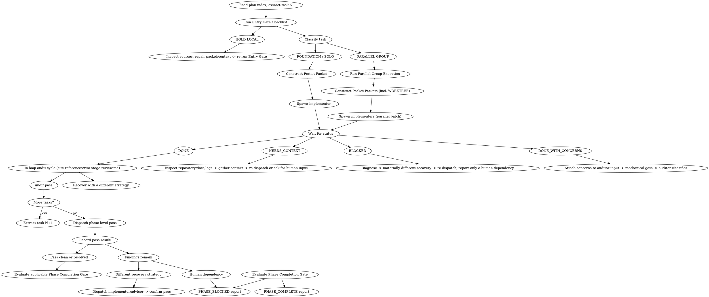

# Pocket Development

Execute an approved Pocket plan one task at a time or in explicitly parallel groups. The main agent coordinates work, runs mechanical checks, and dispatches independent read-only review; implementers own code changes.

**Core principle:** Every delegation is a contract. The packet is the contract. No packet, no spawn. Read `execution-plan/index.md` once to understand execution flow and dependencies, then open individual task files (`execution-plan/tasks/T*-*.md`) on demand when a task is ready to execute.

## Core v4 lifecycle boundary

`pocket-development` is part of the local-first Core role. Core records neutral lifecycle events for approved specs, completed phases, and closed plans. Core does not call `gh`, does not merge pull requests, and does not close issues. A separately installed, optional adapter may consume durable events after a successful compatibility preflight. Core work and phase completion do not depend on that adapter; unavailable delivery leaves events pending for replay.

The v4 lifecycle commands use `--json --contract 3`. `lifecycle transition` commits local state and an event, `lifecycle drain` replays pending events in revision order without creating events, and `lifecycle repair` repairs recoverable `log.json` projection fields without emitting or dispatching an event. Active v3 plans with progress remain on v3; never silently convert their progress.

## Startup: Initialize Execution Log

**Run this before the first task, every session:**

```bash
npx -y pocketto-pi log init "<plan_dir>" --json --contract 3
```

No install step, PATH setup, or shell-specific guard — `npx` resolves the cross-platform binary and `log init` is idempotent, so this is safe to run unconditionally every session. Replace `<plan_dir>` with the folder containing your execution plan (e.g. `docs/pocket/plans/2026-05-08-auth-refactor`).

- No `log.json` yet → creates it from the plan files in that directory
- `log.json` exists but tasks missing → migrates tasks into existing phases (status preserved)
- `log.json` already complete → reports "no migration needed" and writes nothing

Full command reference and update/close commands: see **Execution Log** section below.

**Pocket Education guard.** If the memory file in your context (`CLAUDE.md` / `AGENTS.md`) has no `## Pocket Education` heading, skip this paragraph. If it has one, confirm with `npx -y pocketto-pi edu --json --contract 3`. When `data.education` is `true` (or the command errors), ask whether the user wants to implement with guidance or use subagents—unless the user already explicitly chose subagent execution. An explicit handover in `pocket-education` or direct instruction to dispatch this plan counts as the answer.

---

## When to Use

Use POCKET when the user asks to execute an implementation plan. A completed plan is required; if there is no plan, route to `pocket-planning` rather than inventing one here. Tasks may be sequential, independent, or a mix.

Task count does not gate eligibility. `pocket-planning` routes **every** plan through
`pocket-structuring`, which accepts any task count, so a one-task plan reaches here as a
legitimate Pocket plan. It is simply the degenerate case of `SOLO` — a group resolved to
size 1 — and runs the normal Entry Gate, packet, audit, and phase-pass path. Do not bounce
it to `hotfix`: `hotfix` is an entry-routing choice for small, clear work, not an escape
hatch once a full spec and plan already exist.

**Routing:**
```
Have implementation plan?
    │
    ├── Exactly one task?
    │       │
    │       └── YES → Use POCKET (this skill) — the task is SOLO
    │
    ├── Plan has dependencies or parallel groups?
    │       │
    │       ├── YES → Use POCKET (this skill)
    │       │
    │       └── NO  → Execute ready tasks sequentially; split only if a task cannot be bounded
    │
    └── NO  → Use pocket-planning skill first (requires a spec from pocket-grinding)
```

## Input Types

pocket-development receives two distinct input formats. Identify which type before proceeding.

**Type A — Index manifest / Flat plan** (`execution-plan/index.md` or a flat source plan when the user explicitly chose to skip structuring)
- Produced by pocket-planning / pocket-structuring (single-phase), or by an explicit user choice to use the flat source plan
- Canonical path: read `execution-plan/index.md` once for summary, then open `execution-plan/tasks/T*-*.md` when starting each task
- Override/legacy path: read the flat source plan in full (context-cost accepted) — no per-task files
- Proceed normally through Entry Gate

**Type B — Phase file** (`execution-plan/phase-N.md` or legacy `execution-plan-phase-N.md`)
- Produced by pocket-structuring for plans with multiple phases
- Header contains: `Phase N of M`, `Prerequisite`, `Contains tasks`, `Unlocks next`, `## Phase Completion Gate`
- Reads `execution-plan/phase-N.md` for phase bounds, then opens `execution-plan/tasks/T*-*.md` on demand for each task
- **Before any task execution:**
  1. Extract phase metadata from header: Phase N of M, prerequisite status, task list
  2. Confirm `**Prerequisite:** Phase N-1 must be COMPLETE` is satisfied
  3. If the prerequisite is not COMPLETE, inspect its log and review artifacts. If it is at `REVIEW`, report that `pocket-closing` must be invoked directly by the user; do not start this phase until it confirms `DONE`. Otherwise report the exact gate or human dependency and do not start this phase.
- Track "Phase N of M" context throughout execution — surface it in all status reports
- Terminal step is a structured PHASE_COMPLETE or PHASE_BLOCKED report (see Phase Completion Protocol)

## Main Agent Role

For standard Pocket delegated execution, the main agent is the **Delegator + Gate Runner**: it coordinates implementers, runs mechanical checks, and dispatches a separate read-only auditor. The main agent does not implement tasks or judge code quality and spec compliance. The independent auditor owns those judgments; see `references/two-stage-review.md`.

| Main agent MUST | Main agent MUST NOT |
|-----------------|---------------------|
| Initialize and update pocket log | Write, edit, or create implementation code |
| Construct Pocket Packets and dispatch subagents | Invoke a separate per-task review workflow — dispatch the in-loop auditor instead |
| Run mechanical checks, then dispatch the independent auditor | Judge code quality or spec compliance itself |
| Read task file `execution-plan/tasks/T*-*.md` on demand per task | Read full plan / all task files upfront (avoid context blowout) |
| Emit PHASE_COMPLETE handoff | Claim a skipped or unrun review passed |

If the user explicitly chooses a different implementation mode or asks to skip a Pocket gate, honor that instruction and state which Pocket checks will not run. Keep independent review when the user still expects Pocket verification.

---

## 6 Iron Laws (MANDATORY)

These defaults keep delegated work reviewable. Follow them for Pocket execution; when the user explicitly chooses another workflow or asks to skip a gate, honor that instruction and report which checks will not run.

```
1. PACKET BEFORE STANDARD DISPATCH
   Every task dispatched through the standard Pocket path gets a structured Pocket Packet.
   If the user explicitly chooses a simpler handoff, honor it and report that the packet gate was skipped.
   WHY: The packet is the contract. Without it, expectations are unclear
   and subagents fill gaps with guesses.

2. NO SILENT GATE SKIP
   Run the Entry Gate before standard Pocket dispatch. If the user explicitly chooses to bypass it, report the skipped check.
   WHY: Gate prevents unbounded tasks, wrong task type, and
   ambiguous prompts from reaching subagents.

3. NO TRUST WITHOUT EVIDENCE
   Always verify via read-only review.
   WHY: Subagent reports are self-assessments. Only read-only explore
   agents can verify actual code state.

4. NO AMBIGUOUS PROMPT
   Every prompt follows sandwich structure + attention rules.
   WHY: LLMs have attention drift. Sandwich structure places critical
   content at high-attention positions (start/end).

5. NO SILENT ESCALATION
   Every BLOCKED/NEEDS_CONTEXT has explicit reason + next action.
   WHY: "I'm stuck" without reason creates deadlock. Every status
   must include: what's blocked, why, and what would unblock.

6. NO SILENT REFERENCE
   Cite the Pocket reference that materially informs a packet's task scope or verification.
   WHY: Without citation, we cannot audit decision quality or train improved judgment.
   HOW: Before constructing any packet or making routing decisions, load the
   relevant references and list the ones that informed the packet in `REFERENCES LOADED`.
```

## Entry Gate Checklist

Run the normative Entry Gate Checklist verbatim from `references/entry-gate.md`.

**Summary of Pre-Gate & Items:**
0. **PHASE FILE CHECK** (Type B input only) — Phase metadata extracted and prerequisite phase confirmed COMPLETE?
1. **TASK BOUNDED?** — Read task file `execution-plan/tasks/TN-*.md` on demand when starting TN.
2. **PACKET CONSTRUCTIBLE?** — Can write precise 7-field packet (or 8-field with WORKTREE for PARALLEL GROUP)?
3. **TASK TYPE CLEAR?** — Implementation vs review/audit.
4. **PROMPT SANDWICH?** — Critical instruction at START, constraint at END.
5. **PARALLEL CLASSIFICATION** — Classify as Foundation, Solo, or Parallel Group.
6. **VERIFICATION DEFINED?** — Exact criteria for "done".

ANY "NO" → **HOLD LOCAL**: do not dispatch this packet yet.

`HOLD LOCAL` pauses dispatch, not the whole task. Inspect the plan, repository, logs, and
available documentation; repair the packet or gather missing context, then re-run the gate.
Ask the user only when the next step requires a decision, access, information, or
authorization that cannot be obtained from available sources. Do not implement under this
delegated workflow; if the user explicitly chooses another mode, follow that instruction and
make clear which Pocket checks are being bypassed.

## Mandatory Reference Preloading

Before constructing a Pocket Packet, load the references that define requirements relevant to that task and cite their paths in the packet. Do not load unrelated references or add citation ceremony.

| Task/Situation | Mandatory References to Load |
|----------------|------------------------------|
| Packet construction | `references/pocket-packet.md`; use `references/sandwich-prompt.md` only when useful |
| Entry gate fails | `references/entry-gate.md`; use `references/iron-laws.md` for a specific law |
| Plan has `[parallel: TX]` annotations | `references/entry-gate.md`; then load `references/parallel-group.md` if a group is ready |
| Status is BLOCKED/NEEDS_CONTEXT | `references/status-handling.md` |
| Per-task in-loop audit (after implementer DONE) | `references/two-stage-review.md` |
| Phase completion — all tasks in phase DONE | `references/phase-level-pass.md` |

### Packet Citation

Include a `REFERENCES LOADED` section for the source references that materially shaped the packet:

```markdown
## REFERENCES LOADED
[Reference file name] — [Brief summary of what was learned]
[Reference file name] — [Brief summary of what was learned]
```

Do not list a reference that was not read or does not inform the task.

## Construct the Pocket Packet

Before each dispatch, load `references/pocket-packet.md` and construct all required fields; use `references/sandwich-prompt.md` when prompt structure needs clarification. Preserve every behavioral task's RED-cycle intent and exact commands in source order. The packet reference is authoritative for field definitions and test-intent handling.

For architecture-sensitive work, inspect the relevant implementation, configuration, tests, and call paths before dispatch. This is packet and context verification; it does not make the main agent the implementation auditor. For framework, library, or external API behavior, check the installed version with Context7; if unavailable or insufficient, consult current official documentation. Put the evidence and source paths in the packet. Ask a fresh read-only `advisor` subagent to challenge material architectural assumptions; resolve disagreements with code or documentation evidence before dispatch. The task auditor independently checks the implemented result.

## Delegation Strategy

### Task Type Selection

| Task | Workflow | Access |
|------|----------|--------|
| **Implementation** | Delegate to implementer | Read + Write |
| **Review** | In-loop auditor subagent (`references/two-stage-review.md`) | Read-only |

### Complexity Assessment

Match execution approach to task complexity:

| Task Complexity | Approach | Example |
|-----------------|----------|---------|
| **Mechanical** (1-2 files, clear spec) | Lightweight delegation | Move function, rename, simple refactor |
| **Standard** (2-5 files, some judgment) | Standard delegation | Extract module, restructure imports |
| **Architectural** (complex, high judgment) | Deep delegation with oversight | Design patterns, major refactors |

### Recovery Before Escalation

- Reasoning errors → Gather evidence, ask a fresh `advisor` to challenge the approach, then revise the packet
- Context window overflow → Split into smaller packets and continue in dependency order
- Hallucination issues → Verify claims against the codebase or version-matched official documentation, then re-dispatch with evidence

## The Process

**Non-normative summary.** For the authoritative in-loop audit contract, cite `references/two-stage-review.md`. For the phase-level pass contract, cite `references/phase-level-pass.md`.


```dot
digraph pocket_process {
    rankdir=TB;

    "Read plan index, extract task N" -> "Run Entry Gate Checklist";
    "Run Entry Gate Checklist" -> { "HOLD LOCAL" "Classify task" };
    "Classify task" -> { "FOUNDATION / SOLO" "PARALLEL GROUP" };
    "FOUNDATION / SOLO" -> "Construct Pocket Packet";
    "PARALLEL GROUP" -> "Run Parallel Group Execution";
    "Run Parallel Group Execution" -> "Construct Pocket Packets (incl. WORKTREE)";
    "Construct Pocket Packets (incl. WORKTREE)" -> "Spawn implementers (parallel batch)";
    "Spawn implementers (parallel batch)" -> "Wait for status";
    "HOLD LOCAL" -> "Inspect sources, repair packet/context -> re-run Entry Gate";
    "Construct Pocket Packet" -> "Spawn implementer";
    "Spawn implementer" -> "Wait for status";

    "Wait for status" -> { "DONE" "NEEDS_CONTEXT" "BLOCKED" "DONE_WITH_CONCERNS" };

    "DONE" -> "In-loop audit cycle (cite references/two-stage-review.md)";
    "In-loop audit cycle (cite references/two-stage-review.md)" -> { "Audit pass" "Recover with a different strategy" };

    "NEEDS_CONTEXT" -> "Inspect repository/docs/logs -> gather context -> re-dispatch or ask for human input";
    "BLOCKED" -> "Diagnose -> materially different recovery -> re-dispatch; report only a human dependency";
    "DONE_WITH_CONCERNS" -> "Attach concerns to auditor input -> mechanical gate -> auditor classifies";

    "Audit pass" -> "More tasks?";
    "More tasks?" -> "Extract task N+1" [label="yes"];
    "More tasks?" -> "Dispatch phase-level pass" [label="no"];
    "Dispatch phase-level pass" -> "Record pass result";
    "Record pass result" -> { "Pass clean or resolved" "Findings remain" };
    "Findings remain" -> { "Different recovery strategy" "Human dependency" };
    "Different recovery strategy" -> "Dispatch implementer/advisor -> confirm pass";
    "Pass clean or resolved" -> "Evaluate applicable Phase Completion Gate";
    "Human dependency" -> "PHASE_BLOCKED report";
    "Evaluate Phase Completion Gate" -> { "PHASE_COMPLETE report" "PHASE_BLOCKED report" };
}
```

## Parallel Group Execution

When the Entry Gate classifies ready tasks as a PARALLEL GROUP, load and follow `references/parallel-group.md` for worktree setup, parallel dispatch, audit, merge, recovery, logging, and cleanup. Do not apply its worktree procedure to FOUNDATION or SOLO tasks.

## Prompt Construction

Build prompts from the Pocket Packet. Load `references/sandwich-prompt.md` only when the task needs prompt-structure guidance; the packet's constraints and deliverables take priority over generic prompt formulas.

## Review

Each completed task receives the mechanical gate and independent read-only audit in `references/two-stage-review.md`. The main agent does not replace the auditor's code-quality or spec-compliance judgment.

After all tasks pass, run the independent phase-level pass in `references/phase-level-pass.md` for both flat and phased plans. Complete the handoff in [Phase Completion Protocol](#phase-completion-protocol); `pocket-closing` owns phase advancement from `REVIEW` to `DONE`.

### Core lifecycle events and local recovery

Core uses lifecycle schema `1` and the neutral event vocabulary `spec-approved`, `phase-complete`, and `plan-closed`. The approved-spec handoff uses `pocketto-pi lifecycle transition <spec_dir> spec-approved --artifact <root>:<kind>:<relative-path>:<sha256> --json --contract 3`; phase and closure events are committed by the lifecycle-aware `log update`/`log close` transitions. A lifecycle event stores only artifact references in `lifecycle.json`; references identify artifacts by root, kind, relative path, and SHA-256 digest. Core emits `phase-complete` only after the phase-level pass reaches `REVIEW`, not when closing later changes the phase to `DONE`.

If a projection write needs recovery, first run `pocketto-pi lifecycle repair <spec_dir> --json --contract 3` to reconcile lifecycle-owned fields while preserving task state. Repair does not emit an event or dispatch an adapter and fails closed if task state is unrecoverable. Then run `pocketto-pi lifecycle drain <spec_dir> --json --contract 3` to replay pending events in revision order; drain does not create a new event. With no registered consumer, events remain durable locally and phase completion is not blocked.

## Status Handling

**Non-normative summary.** For the authoritative in-loop audit contract, cite `references/two-stage-review.md`. For the phase-level pass contract, cite `references/phase-level-pass.md`.

| Status | Controller Action |
|--------|-------------------|
| **DONE** | Run the in-loop audit cycle per `references/two-stage-review.md`. |
| **DONE_WITH_CONCERNS** | Route per `references/status-handling.md` § DONE_WITH_CONCERNS (attach concerns verbatim; scope/context blockers → NEEDS_CONTEXT). |
| **NEEDS_CONTEXT** | First inspect available sources and try to gather the missing context; ask the user only if it is unavailable there, then re-dispatch. |
| **BLOCKED** | Use only when a human decision, access, information, or authorization is required; record the specific dependency and next action. |
| **REVIEW_FAIL** (task verdict artifact) | Fix through the correction path in `references/phase-level-pass.md`. `done_sha` NEVER moves. |

Before reporting a task or phase as `BLOCKED`, follow `references/status-handling.md`. A subagent's BLOCKED report is a recovery trigger, not a user-facing verdict. Persist BLOCKED only when the next safe action requires a human dependency; skip tasks that depend on it, continue other ready tasks when safe, and never advance a phase with unresolved work.

## Execution Log

The `pocketto-pi` CLI manages the log — the agent runs commands, no inline file editing. For every plan with an initialized execution log, `log close` closes it after all phases are DONE. Every call takes `--json --contract 3`; parse `data` and check `ok`.

### `log update` — Update status

Update a **phase**:
```bash
npx -y pocketto-pi log update <plan_dir> <phase_file> <status> --json --contract 3
```

Update a **task within a phase** (add `--task <task_id>`):
```bash
npx -y pocketto-pi log update <plan_dir> <phase_file> <status> --task T1 --json --contract 3
```

Task status: `WAITING` → `DONE` | `BLOCKED`
Phase status: `WAITING` → `REVIEW` → `DONE` | `BLOCKED`

### `log close` — Close (after all phases complete)

```bash
npx -y pocketto-pi log close <plan_dir> --json --contract 3
```

Verifies all phases DONE, sets header `status=DONE` + `date_completed`. Returns `ok: false` (exit non-zero) if any phase is not DONE.

### When to run

| Moment | Command |
|--------|---------|
| Session start (no `log.json`) | `log init` — see **Startup** section above |
| Session start (log.json exists, tasks missing) | `log init` — auto-migrates tasks into existing phases |
| In-loop audit passes for a task | `log update --task TN DONE --sha <audited_head>` |
| Unresolvable BLOCKED (task) | `log update --task TN` → `BLOCKED` |
| After the phase-level pass records its result (all tasks already DONE) | `log update` (phase) → `REVIEW` |
| Unresolvable BLOCKED (phase) | `log update` (phase) → `BLOCKED` |
| All phases complete (plan has an execution log) | `log close` |

**Phase-completion ordering:** dispatch the phase-level pass → record a clean or resolved result → set the phase to `REVIEW`. The `REVIEW` transition records the neutral `phase-complete` event only after `reviews/phase-pass-<phase_key>.json` carries that result (`references/phase-level-pass.md`).

**IMPORTANT:** NEVER set task status to `DONE` before the in-loop audit completes and `--sha <audited_head>` is passed. NEVER set task status to `REVIEW` — that status is for phases only.

`log.json` lives in `docs/pocket/plans/{slug}/log.json` — this is pocket-closing's primary input.

---

## Phase Completion Protocol

Runs for every plan phase, flat or phased, after all tasks reach DONE and their per-task in-loop audits pass. When a Type B phase file supplies `## Phase Completion Gate`, evaluate its conditions verbatim. For a flat Type A plan without that section, verify all tasks are DONE, their tests and commits meet the plan's requirements, and the phase-level pass has a clean or resolved result.

**Ordering is fixed: dispatch the phase-level pass → record its result → set phase status `REVIEW` → emit the `PHASE_COMPLETE` handoff.** The phase transition records the neutral `phase-complete` event only after the pass result exists.

**Step 1 — Run the phase-level pass, then evaluate the Phase Completion Gate.** Once every task is `DONE`, dispatch the phase-level pass and let it record its result at `<plan_dir>/reviews/phase-pass-<phase_key>.json` (contract: `references/phase-level-pass.md`). Then evaluate the gate — copy the phase file's `## Phase Completion Gate` conditions verbatim, plus the pass condition:
```
[ ] Every task in this phase: status DONE
[ ] All tests pass
[ ] All commits created with correct format
[ ] No task has status BLOCKED or NEEDS_CONTEXT
[ ] Phase-level pass recorded a terminal result at
    <plan_dir>/reviews/phase-pass-<phase_key>.json
    (PHASE_PASS_CLEAN or PHASE_PASS_RESOLVED — references/phase-level-pass.md)
```

**Step 2 — Set `REVIEW`, then emit the structured report:**

If all conditions pass — set the phase to `REVIEW` (`log update` (phase) → `REVIEW`, only now that the pass result is recorded), then report:
```
PHASE_COMPLETE: Phase N of M
Tasks: [T1, T2, T4] — all DONE
Commits: [commit message list]
Tests: green
Phase-level pass: <PHASE_PASS_CLEAN | PHASE_PASS_RESOLVED> at
  <plan_dir>/reviews/phase-pass-<phase_key>.json
Phase status: REVIEW
Gate: PASS
Next: run `/pocketto:pocket-closing <plan_dir>/<phase_file>`.
→ Stop here. `pocket-closing` is invoked directly by the user; continue after it reports this phase DONE.
```

If a condition fails, first attempt an evidence-backed correction that stays within the approved outcome, then rerun the relevant gate. Report `PHASE_BLOCKED` only when the next safe action requires a human decision, access, information, or authorization:
```
PHASE_BLOCKED: Phase N of M
Failed gate condition: [which condition]
Blocked task: TN | Blocker category: [type]
Unblocking action: [specific required action]
→ Do NOT proceed to Phase N+1
```

If findings remain after a phase-level recovery, reassess them and continue with a materially different correction or fresh independent review. Do not set `PHASE_BLOCKED` because a cycle or recovery counter reached its limit. Set `PHASE_BLOCKED` only when the next safe action requires a human decision, access, information, or authorization. Until then, keep the phase out of `REVIEW` and report the concrete recovery underway.

When a human dependency is real, the pass record carries `status: "PHASE_BLOCKED"` and the outstanding findings (`references/phase-level-pass.md`). Report:
```
PHASE_BLOCKED: Phase N of M
Failed gate condition: The next safe correction requires a human decision or authorization
Pass record: <plan_dir>/reviews/phase-pass-<phase_key>.json (status PHASE_BLOCKED)
Outstanding findings: [from the pass record]
Unblocking action: human resolves the outstanding findings
→ Do NOT proceed to Phase N+1; phase status MUST NOT become REVIEW
```

After closing reports the phase `DONE`, proceed to Phase N+1 only if the user's authorization covers the full plan; otherwise stop and report the next step.

---

## User Instructions and Recovery

Follow the user's explicit instruction when it authorizes a workflow choice or gate. State a material consequence briefly, then proceed. Preserve independent review when the user expects Pocket verification, and report any gate the user chose to skip; never claim a skipped gate passed.

Before escalating `NEEDS_CONTEXT` or `BLOCKED`, inspect the repository, plan, logs, and available documentation; repair the packet or dispatch a fresh subagent when that can resolve the issue. A cycle count, retry count, uncertainty that can be investigated, or subagent failure alone is not a human blocker. See `references/status-handling.md`, `references/two-stage-review.md`, and `references/phase-level-pass.md` for recovery contracts.

## Red Flags

**While following the standard Pocket delegated path, avoid:**
- Implement code yourself instead of delegating to a subagent
- Read full plan upfront instead of opening individual task files `execution-plan/tasks/T*-*.md` on demand
- Invoke a separate per-task review workflow — per-task review is the in-loop auditor (see `references/two-stage-review.md`)
- Mark task DONE in the log without a passing in-loop audit (mechanical gate + read-only auditor)
- Mark a task DONE without passing `--sha <audited_head>`

**Delegation violations:**
- Delegate without a Pocket Packet
- Skip the Entry Gate Checklist
- Trust a subagent's report without verification (mechanical gate, then dispatch the read-only auditor — the main agent never judges code)
- Give ambiguous prompts ("handle X", "fix Y")
- Report BLOCKED without identifying the human dependency and concrete unblock action
- Accept vague escalation ("I'm stuck" without reason)
- Dispatch a parallel group without creating worktrees first — collision risk on `git status`, `git log`, lockfiles, shared registries
- Merge a parallel group before ALL tasks in the group audit-pass — partial merges create ambiguous parent SHAs for the rest
- Merge the whole parallel group, THEN `log update` each task — every update captures the final merge commit, collapsing all tasks onto one `done_sha` and silently voiding their per-task review scope. Merge + log one task at a time. The CLI hard-errors on the duplicate (`DUPLICATE_DONE_SHA`); repair with `--sha <that task's own merge commit>`

**If agent asks questions:**
- Answer clearly and completely
- Provide additional context if needed
- Don't rush into implementation

**If reviewer finds issues:**
- Implementer fixes them
- Reviewer reviews again
- Repeat until approved

## Reference Triggers

Load these reference files when SKILL.md says "see reference for details" or when you encounter edge cases. **Per Iron Law #6, you must cite which reference was loaded in every Pocket Packet.**

| Reference | When to Load | What You'll Learn |
|-----------|--------------|-------------------|
| `references/iron-laws.md` | A specific delegation invariant needs clarification | Enforcement details and recovery examples |
| `references/entry-gate.md` | Gate checklist needs its decision matrix or classification examples; plan has `[parallel: TX]` annotations | Decision tree for gate pass/fail; Foundation/Parallel-Group/Solo classification rules |
| `references/pocket-packet.md` | Packet construction unclear, need field-by-field guide | Complete field definitions with examples |
| `references/sandwich-prompt.md` | Need attention mechanic details or method selection | Sandwich structure variations |
| `references/two-stage-review.md` | After implementer reports DONE; mechanical gate, auditor dispatch, fix/refactor, SHA pinning | Normative in-loop audit contract. Cite it; do not restate it. |
| `references/phase-level-pass.md` | All tasks in the phase are DONE — before the phase may become `REVIEW`, or a `REVIEW_FAIL` needs its correction path | Phase-level pass contract: dispatch, result record, recovery, append-only corrections, verdict fan-out. Cite it; do not restate it. |
| `references/status-handling.md` | An implementer or reviewer reports NEEDS_CONTEXT/BLOCKED | Evidence gathering, recovery choices, and human-only escalation |
| `references/parallel-group.md` | Entry Gate classifies ready tasks as PARALLEL GROUP | Worktree setup, dispatch, audit, merge, recovery, and cleanup |
