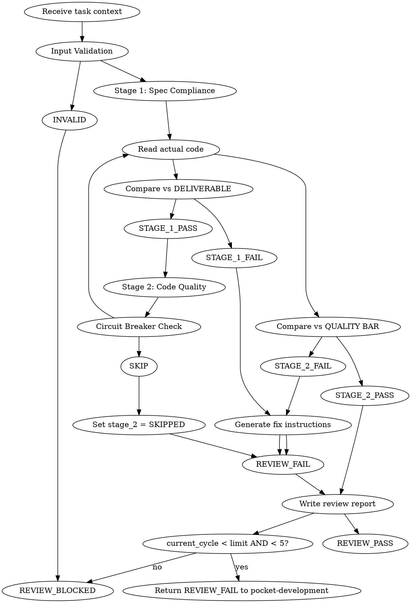

# Pocket Review

Independent two-stage review skill extracted from pocket-development. Verifies implementer output against spec compliance (Stage 1) then code quality (Stage 2), with bounded review loop and structured escalation.

**Core principle:** Review is a pipeline, not a checkpoint. Spec compliance before quality. Never trust self-reports — always read actual code.

## Position in Pocket Bundle

```
pocket-grinding → pocket-planning → pocket-structuring → pocket-development → POCKET-REVIEW → pocket-closing
                                                                         ↑
                                                                   invoked by
                                                              pocket-development
```

pocket-review is **never invoked directly by the user**. It is called by pocket-development after each implementer reports DONE.

## When to Use

**Trigger:** pocket-development invokes this skill after implementer status = DONE.

**Only invoke on DONE.** If implementer reported DONE_WITH_CONCERNS, pocket-development must assess concerns first. If observation-only, proceed. If correctness risk, address before invoking.

**Input contract (from pocket-development):**

| Field | Type | Required | Description |
|-------|------|----------|-------------|
| `plan_dir` | path | Yes | Plan directory containing phase file + log.json. Structure: `plan_dir/` contains phase file directly, `plan_dir/reviews/` for output. |
| `phase_file` | filename | Yes | Phase file for Type B (`execution-plan-phase-N.md`) or flat plan for Type A (`execution-plan.md`). Always exists directly in `plan_dir/`. |
| `task_id` | string | Yes | Task identifier (e.g., `T3`) |
| `task_name` | string | Yes | Human-readable task name |
| `files_changed` | list | Yes | Files created/modified by implementer. Must be non-empty. |
| `spec_ref` | string | Yes | Absolute file path to spec file. Optionally append `#section` fragment for direct rule reference (e.g., `docs/pocket/spec/auth/topic.md#rule-3`). |
| `quality_bar` | object | Yes | Must-have, must-not-have, red flags from Pocket Packet. Must be non-empty. |
| `concerns` | list | No | Concerns flagged by implementer (empty list `[]` if none). |
| `review_loop_limit` | int | Yes | Max review cycles. Default: 2. Hard cap: 5 (even if limit > 5, escalation fires at cycle 5). |
| `current_cycle` | int | Yes | Current review cycle number (1-indexed). First invocation = 1. Passed by pocket-development. |

**Output contract (to pocket-development):**

| Status | Meaning | pocket-development Action |
|--------|---------|--------------------------|
| `REVIEW_PASS` | Both stages passed | Extract `fix_instructions` (empty), update log → DONE |
| `REVIEW_FAIL` | Issues found, fixable | Extract `fix_instructions` from report, re-dispatch implementer |
| `REVIEW_BLOCKED` | Max cycles exceeded or input invalid | Extract `fix_instructions` for human, escalate, halt phase |

**Extract fix instructions from:** `reviews/<task_id>-cycle-<N>.json` → `fix_instructions` field. Pass verbatim to implementer in next Pocket Packet.

## Input Validation (BEFORE Stage 1)

**Mandatory gate.** Validate ALL inputs before reading any code.

```
1. phase_file exists at <plan_dir>/<phase_file>?
   FAIL → REVIEW_BLOCKED: "Phase file not found: <path>"

2. files_changed is non-empty?
   FAIL → REVIEW_BLOCKED: "files_changed is empty — no code to review"

3. spec_ref resolves to a readable file?
   (If spec_ref contains #fragment, strip fragment and check file)
   FAIL → REVIEW_BLOCKED: "Spec file not found: <path>"

4. quality_bar is non-empty (has at least one must-have or must-not-have)?
   FAIL → REVIEW_BLOCKED: "quality_bar is empty — cannot assess code quality"

5. current_cycle <= review_loop_limit OR current_cycle <= 5 (hard cap)?
   FAIL → REVIEW_BLOCKED: "Cycle <N> exceeds limit — human escalation required"
```

ANY validation FAIL → Return REVIEW_BLOCKED immediately. Do not proceed to Stage 1.

## 4 Iron Laws

```
1. NO SKIP THE STAGES
   Stage 1 (spec) MUST pass before Stage 2 (quality) runs.
   ENFORCEMENT: Stage 2 checks Stage 1 result at start. If FAIL → SKIPPED.

2. NO TRUST WITHOUT EVIDENCE
   Always read ACTUAL code, NOT implementer's report.
   WHY: Self-assessments are unreliable. Only code inspection reveals truth.

3. NO UNBOUNDED LOOP
   Review loop has hard cap at 5 cycles, regardless of review_loop_limit.
   WHY: Infinite review loops waste tokens and stall progress.

4. NO SILENT ESCALATION
   Every REVIEW_BLOCKED includes: what failed, why, what would unblock.
   WHY: "I'm stuck" without reason creates deadlock.
```

## The Process



## Stage 1: Spec Compliance

**Mode:** Read-only review

**Question:** Did the implementer build the RIGHT thing?

### Verification Process

```
1. Read the phase file at <plan_dir>/<phase_file>
   → extract task's DELIVERABLE section

2. Read the spec file at <spec_ref> (strip #fragment if present)
   → extract acceptance criteria rule

3. Read ACTUAL code files from files_changed (NOT implementer's report)

4. For each DELIVERABLE item:
   - [ ] Requirement present in code?
   - [ ] Behavior matches spec?
   - [ ] No extra work not in spec?

5. Handle concerns if present:
   - Correctness risk → investigate and report as Stage 1 finding
   - Observation → note in report, proceed
   - null/empty concerns → skip concerns handling

6. Report with file:line references
```

### Output Format

```
✅ SPEC COMPLIANT
   All requirements verified:
   - [x] <requirement 1> (<file>:<line>)
   - [x] <requirement 2> (<file>:<line>)

❌ ISSUES FOUND
   Missing requirements:
   - [ ] <description> (<file>:<line> or "not found")
   Extra work:
   - [+] <description> (<file>:<line>)
   Misunderstanding:
   - [~] <description> — expected X, got Y (<file>:<line>)
```

**Reference:** `references/spec-compliance-review.md` for full DO/DON'T table and edge cases.

## Stage 2: Code Quality

**Mode:** Read-only review

**Question:** Did the implementer build it WELL?

### Circuit Breaker (Run First)

```
IF Stage_1.status = FAIL in this invocation:
  - Set stage_2.status = "SKIPPED"
  - Set stage_2.assessment = "N/A"
  - Skip all remaining Stage 2 steps
  - Proceed to review report generation
```

### Verification Process

```
1. Read ACTUAL code files from files_changed

2. Check against QUALITY BAR from Pocket Packet:
   - Must-have items present?
   - Must-not-have items absent?
   - No red flags triggered?

3. Check code quality:
   - Follows existing codebase patterns?
   - Proper error handling?
   - Tests verify behavior (not just pass)?
   - Clean, maintainable structure?

4. Classify issues by severity
```

### Issue Severity

| Severity | Meaning | Action |
|----------|---------|--------|
| **Critical** | Security risk, data loss possible | Must fix before PASS |
| **Important** | Bug risk, maintainability impact | Must fix before PASS |
| **Minor** | Style, preferences | Note, implementer may fix |

### Output Format

```
STRENGTHS:
- <positive observation 1>
- <positive observation 2>

ISSUES:
- [Critical] <description> (<file>:<line>)
- [Important] <description> (<file>:<line>)
- [Minor] <description> (<file>:<line>)

ASSESSMENT: Approved | Request Changes
```

**Reference:** `references/code-quality-review.md` for full checklist and severity classification guide.

## Review Loop

When either stage fails:

```
1. Generate fix instructions (specific, with file:line references)
2. Write review report to <plan_dir>/reviews/<task_id>-cycle-<N>.json
3. Check: current_cycle < review_loop_limit AND current_cycle < 5?
   YES → Return REVIEW_FAIL to pocket-development
   NO  → Return REVIEW_BLOCKED
```

**Loop limit:**
- Soft limit: `review_loop_limit` (default: 2)
- Hard cap: 5 cycles absolute maximum
- If review_loop_limit > 5, escalation still fires at cycle 5

**Escalation:**
```
REVIEW_BLOCKED: Task T3 (Phase N of M)
Failed after: <N> review cycles (hard cap: 5)
Remaining issues:
  - [Critical] Token expiry not checked (auth_service.py:42) — failed across cycles
  - [Important] Magic number 3600 (auth_service.py:45) — failed across cycles
Root cause: Implementer consistently misses error handling patterns
Recommended action: Human review of error handling approach, possible task split
→ Awaiting human decision
```

## Review Report Artifact

Every review cycle writes to `reviews/` subdirectory:

```
docs/pocket/plans/{slug}/
├── log.json
├── <phase_file>
└── reviews/
    ├── T3-cycle-1.json
    ├── T3-cycle-2.json
    └── ...
```

**Write before returning control.** Report file name: `<task_id>-cycle-<current_cycle>.json`

### Report JSON Schema

Required fields: `task_id`, `task_name`, `cycle`, `timestamp`, `reviewer_config`, `stage_1`, `stage_2`, `overall`, `fix_instructions`, `loop_info`

```json
{
  "task_id": "T3",
  "task_name": "Extract auth layer",
  "cycle": 1,
  "timestamp": "2026-05-08T12:00:00Z",
  "reviewer_config": "standard",
  "stage_1": {
    "status": "PASS",
    "issues": [],
    "concerns_addressed": []
  },
  "stage_2": {
    "status": "PASS",
    "strengths": ["Clean separation", "Tests passing"],
    "issues": [],
    "assessment": "Approved"
  },
  "overall": "REVIEW_PASS",
  "fix_instructions": "",
  "loop_info": {
    "current_cycle": 1,
    "max_cycles": 2,
    "cycles_remaining": 1
  }
}
```

**Reference:** `references/review-report-template.md` for full schema and all examples.

## Model Tiering for Reviewers

| Stage | Complexity | When to Escalate |
|-------|------------|------------------|
| Stage 1: Spec Compliance | Standard | Escalate if spec is complex or multi-file |
| Stage 2: Code Quality | Standard | Escalate for architectural review or high-risk code |

**Escalation within a loop:** If Stage 1 fails due to reasoning errors (reviewer misunderstood spec — distinguish from real spec violation by checking if the issue is about spec interpretation vs missing code), escalate to deeper review before re-review. Record configuration used in `reviewer_config` field.

## Red Flags

**Never do:**
- Skip Stage 1 and go straight to Stage 2
- Trust implementer's self-report without reading code
- Run Stage 2 on spec-non-compliant code (circuit breaker should prevent)
- Exceed review loop limit without escalating
- Accept vague fix instructions ("handle edge cases")
- Review without file:line references
- Invoke on DONE_WITH_CONCERNS without clearance from pocket-development

**If code is unreadable:**
- Report as Stage 2 issue: [Important] Code readability
- Do not attempt to review quality of incomprehensible code

**If spec is ambiguous:**
- Report as Stage 1 issue: [missing] Ambiguous spec — cannot verify
- Do not guess intent — escalate to human

**If spec vs quality conflict (code matches spec but spec has security flaw):**
- Stage 1: PASS (code matches spec)
- Stage 2: Flag as Critical issue with note: "Spec compliance confirmed but potential spec-level security concern"
- Escalate: "Spec vs quality conflict — human decision needed on whether spec should change"

## Reference Triggers

| Reference | When to Load |
|-----------|--------------|
| `references/spec-compliance-review.md` | Stage 1 review — full verification protocol |
| `references/code-quality-review.md` | Stage 2 review — quality checklist + severity guide |
| `references/review-report-template.md` | Writing review report artifact — schema + examples |
